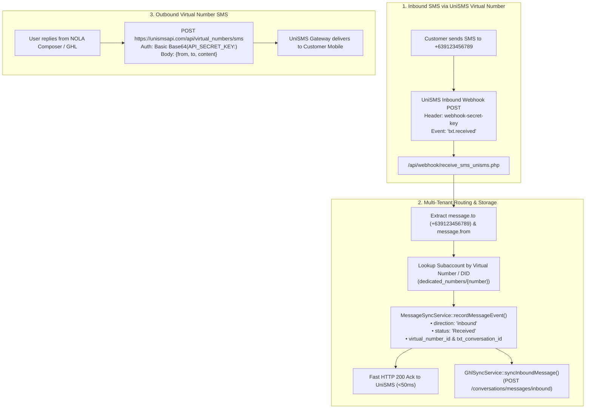

# Backend Implementation Plan: 2-Way SMS Platform (UniSMS & Semaphore)

**Target Repository:** `c:\Users\User\nola-sms-pro-backend`

---

## 1. Overview & UniSMS Virtual Numbers Specifications

Based on the official **UniSMS Virtual Numbers API Specification** (`https://unismsapi.com/docs/virtual_numbers`), UniSMS provides dedicated Philippine virtual numbers (`+639XXXXXXXXX`) for 2-way SMS communication with standard REST endpoints and webhooks.

### UniSMS Technical Contract Summary



### UniSMS API Endpoints & Payloads

1. **Inbound Webhook (`event: "txt.received"`):**
   * **Endpoint:** `https://api.nolasmspro.com/api/webhook/receive_sms_unisms.php`
   * **Headers:**
     * `Content-Type: application/json`
     * `webhook-id: <unique_id>`
     * `webhook-secret-key: <configured_secret>`
   * **Payload:**
     ```json
     {
       "id": "msg_84e8b93b-6315-46af-a686",
       "event": "txt.received",
       "message": {
         "from": "+639987654321",
         "to": "+639123456789",
         "content": "Hello! I am interested in your offer.",
         "virtual_number_id": "vn_4a3f8b2c-9d1e-4f5a-8b7c-2d6e0a1b3c4d",
         "txt_conversation_id": "tcon_7ef5f85e-1f2e-4a8a-9f43-483c8beb93bb",
         "reference_id": "tmsg_..."
       }
     }
     ```

2. **Outbound Virtual Number SMS Endpoint:**
   * **Method & URL:** `POST https://unismsapi.com/api/virtual_numbers/sms`
   * **Authentication:** `Authorization: Basic Base64(API_SECRET_KEY:)`
   * **Request Body:**
     ```json
     {
       "from": "+639123456789",
       "to": "+639987654321",
       "content": "Hi Juan, thank you for reaching out!"
     }
     ```
   * **Important Rule:** UniSMS Virtual Numbers policy specifies that links, URLs, and OTPs should be sent via an alphanumeric Sender ID. Standard conversational text messages are fully supported via Virtual Numbers.

3. **Get Virtual Number Details:**
   * `GET https://unismsapi.com/api/virtual_numbers/:reference_id`
   * Returns status: `active | pending | unregistered | inactive`.

---

## 2. File-by-File Backend Code Instructions

### File 1: `api/webhook/simulate_inbound_sms.php` [NEW]

**Purpose:** Simulation endpoint for instant development & testing before carrier number delivery. Matches exact UniSMS & Semaphore inbound schemas.

**Location:** `c:\Users\User\nola-sms-pro-backend\api\webhook\simulate_inbound_sms.php`

**Implementation Code:**
```php
<?php
require_once __DIR__ . '/../cors.php';
require_once __DIR__ . '/firestore_client.php';
require_once __DIR__ . '/../auth_helpers.php';
require_once __DIR__ . '/../services/MessageSyncService.php';
require_once __DIR__ . '/../services/GhlSyncService.php';

header('Content-Type: application/json');
validate_api_request();

$raw = file_get_contents('php://input');
$data = json_decode($raw, true) ?: $_POST;

$locationId   = trim((string)($data['location_id'] ?? ''));
$senderPhone  = trim((string)($data['from'] ?? $data['sender'] ?? ''));
$messageText  = trim((string)($data['message'] ?? $data['content'] ?? $data['text'] ?? ''));
$receiverDid  = trim((string)($data['to'] ?? $data['receiver'] ?? ''));
$syncGhl      = isset($data['sync_ghl']) ? (bool)$data['sync_ghl'] : true;

if (!$locationId || !$senderPhone || !$messageText) {
    http_response_code(400);
    echo json_encode([
        'success' => false,
        'error' => 'Missing required fields: location_id, from, message'
    ]);
    exit;
}

$db = get_firestore();

// Normalize to standard Philippine format
$cleanPhone = preg_replace('/\D/', '', $senderPhone);
if (str_starts_with($cleanPhone, '639') && strlen($cleanPhone) === 12) {
    $cleanPhone = '0' . substr($cleanPhone, 2);
} elseif (str_starts_with($cleanPhone, '9') && strlen($cleanPhone) === 10) {
    $cleanPhone = '0' . $cleanPhone;
}

$convId = $locationId . '_conv_' . $cleanPhone;
$messageId = 'sim_in_' . uniqid() . '_' . $locationId;
$now = new \Google\Cloud\Core\Timestamp(new \DateTime());

// Record in Firestore
$eventResult = MessageSyncService::recordMessageEvent($db, [
    'origin' => 'simulator_inbound',
    'conversation_id' => $convId,
    'conversation_type' => 'direct',
    'conversation_members' => [$cleanPhone],
    'location_id' => $locationId,
    'message_id' => $messageId,
    'from' => $cleanPhone,
    'to' => $receiverDid ?: null,
    'message' => $messageText,
    'direction' => 'inbound',
    'status' => 'Received',
    'date_received' => $now,
    'timestamp' => $now,
    'provider' => 'simulator',
    'write_inbound_compat' => true,
]);

// Sync to GoHighLevel CRM
$ghlResult = null;
if ($syncGhl) {
    try {
        $ghlSync = new \Nola\Services\GhlSyncService($db, $locationId);
        $ghlResult = $ghlSync->syncInboundMessage($cleanPhone, $messageText);
    } catch (\Throwable $e) {
        $ghlResult = ['success' => false, 'error' => $e->getMessage()];
    }
}

echo json_encode([
    'success' => true,
    'message' => 'Simulated inbound message successfully processed',
    'data' => [
        'conversation_id' => $convId,
        'message_id' => $messageId,
        'location_id' => $locationId,
        'from' => $cleanPhone,
        'message' => $messageText,
        'direction' => 'inbound',
        'ghl_sync' => $ghlResult
    ]
], JSON_PRETTY_PRINT);
```

---

### File 2: `api/webhook/receive_sms_unisms.php` [MODIFY]

**Purpose:** Update UniSMS inbound handler to fully parse `txt.received` payloads and map the dedicated virtual number (`message.to`) directly to the owning location.

**Location:** `c:\Users\User\nola-sms-pro-backend\api\webhook\receive_sms_unisms.php`

**Key Implementation Logic:**
```php
// 1. Verify Webhook Secret (Header: webhook-secret-key or X-Webhook-Secret)
$secretHeader = unisms_header_value('webhook-secret-key') ?: unisms_header_value('X-Webhook-Secret');

// 2. Handle UniSMS 'txt.received' event
if ($event === 'txt.received' || $event === 'message.received' || $event === 'message.inbound') {
    $senderRaw = $messageObj['from'] ?? $messageObj['sender'] ?? $data['sender'] ?? '';
    $receiverRaw = $messageObj['to'] ?? $messageObj['receiver'] ?? $data['receiver'] ?? '';
    $message = $messageObj['content'] ?? $messageObj['message'] ?? $data['message'] ?? '';
    $virtualNumberId = $messageObj['virtual_number_id'] ?? null;
    $txtConversationId = $messageObj['txt_conversation_id'] ?? null;

    $senderNumber = unisms_clean_number($senderRaw);
    $receiverNumber = unisms_clean_number($receiverRaw);

    // 3. Multi-Tenant Location Resolution
    $locId = null;

    // Tier 1: Look up location by assigned Virtual Number in Firestore
    if ($receiverNumber !== '') {
        $didSnap = $db->collection('dedicated_numbers')->document($receiverNumber)->snapshot();
        if ($didSnap->exists()) {
            $locId = $didSnap->data()['location_id'] ?? null;
        }
    }

    // Tier 2: Check URL param (?location_id=LOC_XXX)
    if (!$locId && !empty($_GET['location_id'])) {
        $locId = trim((string)$_GET['location_id']);
    }

    // Tier 3: Active Thread Match Fallback
    if (!$locId) {
        $convQuery = $db->collection('conversations')
            ->where('members', 'array-contains', $senderNumber)
            ->orderBy('last_message_at', 'DESC')
            ->limit(1)
            ->documents();
        foreach ($convQuery as $doc) {
            if ($doc->exists()) {
                $locId = $doc->data()['location_id'] ?? null;
                break;
            }
        }
    }

    if (!$locId) {
        error_log("[receive_sms_unisms] Dropped: unmapped virtual number {$receiverNumber} or sender {$senderNumber}");
        unisms_json(200, ['status' => 'ignored', 'reason' => 'unmapped_recipient']);
    }

    $convId = $locId . '_conv_' . $senderNumber;
    $now = new \Google\Cloud\Core\Timestamp(new \DateTime());
    $messageId = ($data['id'] ?? uniqid('unisms_in_')) . '_' . $locId;

    // 4. Record Inbound Event via MessageSyncService
    MessageSyncService::recordMessageEvent($db, [
        'origin' => 'provider_inbound_unisms',
        'conversation_id' => $convId,
        'conversation_type' => 'direct',
        'conversation_members' => [$senderNumber],
        'location_id' => $locId,
        'message_id' => $messageId,
        'from' => $senderNumber,
        'to' => $receiverNumber,
        'message' => $message,
        'direction' => 'inbound',
        'status' => 'Received',
        'date_received' => $now,
        'timestamp' => $now,
        'provider' => 'unisms',
        'provider_reference_id' => (string)($data['id'] ?? ''),
        'unisms_virtual_number_id' => $virtualNumberId,
        'unisms_txt_conversation_id' => $txtConversationId,
        'write_inbound_compat' => true,
    ]);

    // 5. Immediate Fast Ack to UniSMS (<50ms)
    unisms_flush_early_response(['status' => 'success', 'message' => 'Received']);

    // 6. Async Background Sync to GoHighLevel CRM
    try {
        $ghlSync = new \Nola\Services\GhlSyncService($db, $locId);
        $ghlSync->syncInboundMessage($senderNumber, $message);
    } catch (\Throwable $e) {
        error_log("[receive_sms_unisms] GHL Sync failed: " . $e->getMessage());
    }
    exit;
}
```

---

### File 3: `api/services/providers/UniSmsProvider.php` [MODIFY]

**Purpose:** Add support for sending outbound SMS from a dedicated virtual number via `POST /virtual_numbers/sms`.

**Location:** `c:\Users\User\nola-sms-pro-backend\api\services\providers\UniSmsProvider.php`

**Implementation Method:**
```php
public function sendVirtualNumberSms(string $fromVirtualNumber, string $toNumber, string $content, ?string $apiKey = null): array
{
    $url = 'https://unismsapi.com/api/virtual_numbers/sms';
    $key = trim((string)($apiKey ?: $this->apiKey));

    // Convert numbers to E.164 format (+639XXXXXXXXX)
    $formattedFrom = str_starts_with($fromVirtualNumber, '+') ? $fromVirtualNumber : ('+63' . ltrim(preg_replace('/\D/', '', $fromVirtualNumber), '0'));
    $formattedTo   = str_starts_with($toNumber, '+') ? $toNumber : ('+63' . ltrim(preg_replace('/\D/', '', $toNumber), '0'));

    $body = json_encode([
        'from' => $formattedFrom,
        'to'   => $formattedTo,
        'content' => $content
    ]);

    $ch = curl_init($url);
    curl_setopt_array($ch, [
        CURLOPT_POST => true,
        CURLOPT_RETURNTRANSFER => true,
        CURLOPT_HTTPHEADER => ['Content-Type: application/json'],
        CURLOPT_USERPWD => $key . ':',
        CURLOPT_POSTFIELDS => $body,
        CURLOPT_TIMEOUT => 15,
    ]);

    $response = curl_exec($ch);
    $httpCode = curl_getinfo($ch, CURLINFO_HTTP_CODE);
    $curlError = curl_error($ch);
    curl_close($ch);

    if ($curlError) {
        throw new UniSmsTimeoutException("UniSMS Virtual Number timeout: {$curlError}", 'unisms', $curlError);
    }

    $decoded = json_decode((string)$response, true);
    return [
        'success' => $httpCode >= 200 && $httpCode < 300,
        'status_code' => $httpCode,
        'data' => $decoded
    ];
}
```

---

### File 4: `api/messages.php` [MODIFY]

**Purpose:** Return `direction`, `from`, `sender_name`, `date_received`, and normalized `status: 'Received'` for inbound messages in the `/api/messages?conversation_id=...` endpoint.

**Location:** `c:\Users\User\nola-sms-pro-backend\api\messages.php`

**Changes (lines 260–285):**
```php
foreach ($query->documents() as $doc) {
    if (!$doc->exists()) continue;
    $d = $doc->data();
    \Nola\Services\StatusSync::checkAndSyncSingleMessage($db, $d, $doc->id(), $apiKey, $apiKeyCache);
    
    $msgDirection = strtolower(trim((string)($d['direction'] ?? 'outbound')));
    $msgStatus = $msgDirection === 'inbound' ? 'Received' : $mapStatus($d['status'] ?? null);

    $out['data'][] = [
        'id' => $doc->id(),
        'message_id' => $d['message_id'] ?? null,
        'conversation_id' => $d['conversation_id'] ?? null,
        'location_id' => $d['location_id'] ?? null,
        'number' => $d['number'] ?? null,
        'from' => $d['from'] ?? null,
        'message' => $d['message'] ?? null,
        'direction' => $msgDirection,
        'sender_id' => $d['sender_id'] ?? null,
        'sender_name' => $d['sender_name'] ?? ($d['sender_id'] ?? null),
        'status' => $msgStatus,
        'batch_id' => $d['batch_id'] ?? null,
        'recipient_key' => $d['recipient_key'] ?? null,
        'date_created' => isset($d['date_created']) ? $d['date_created']->formatAsString() : null,
        'date_received' => isset($d['date_received']) ? $d['date_received']->formatAsString() : null,
        'created_at' => isset($d['created_at']) ? $d['created_at']->formatAsString() : (isset($d['date_created']) ? $d['date_created']->formatAsString() : null),
        'name' => $d['name'] ?? null,
    ];
}
```

---

## 3. Testing & Verification

```bash
# Test Inbound Simulation (Works immediately without number)
curl -X POST "https://api.nolasmspro.com/api/webhook/simulate_inbound_sms.php" \
  -H "Content-Type: application/json" \
  -H "X-Webhook-Secret: <SECRET>" \
  -d '{
    "location_id": "YOUR_LOCATION_ID",
    "from": "09171234567",
    "to": "+639123456789",
    "message": "Hi Juan, yes I confirm my booking!"
  }'
```
