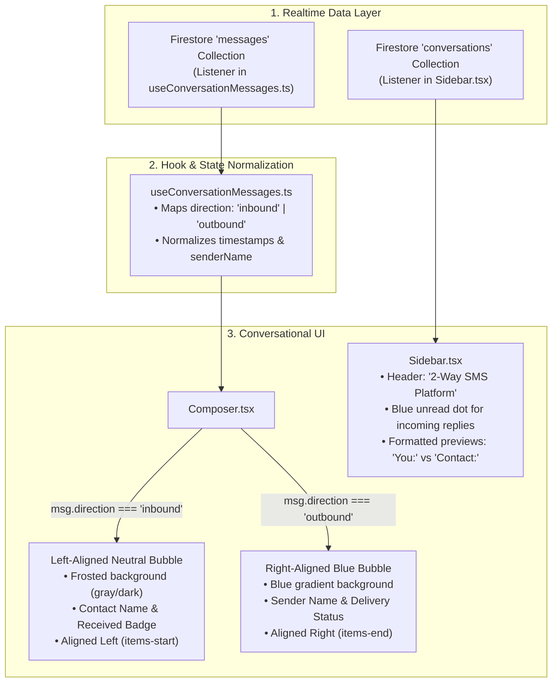

# Frontend Implementation Plan: 2-Way SMS Platform

**Target Repository:** `c:\Users\User\nola-sms-pro`

---

## 1. Overview & UI/UX Architecture

This plan covers the frontend changes required to transform the NOLA SMS Pro portal into a bidirectional **2-Way Conversational SMS Chat Platform**, supporting incoming customer replies from both **UniSMS Virtual Numbers** and **Semaphore Numbers**.



---

## 2. File-by-File Frontend Code Instructions

### File 1: `user/src/types/Sms.ts` [MODIFY]

**Purpose:** Update TypeScript type definitions to support bidirectional messaging fields.

**Location:** `c:\Users\User\nola-sms-pro\user\src\types\Sms.ts`

**Changes to Implement:**
```typescript
export interface Message {
  id: string;
  text: string;
  timestamp: Date;
  senderName: string;
  direction?: 'inbound' | 'outbound';
  status: 'sending' | 'sent' | 'delivered' | 'failed' | 'received' | 'pending' | string;
  from?: string;
  number?: string;
  conversation_id?: string;
  date_received?: FirestoreTimestamp;
  date_created?: FirestoreTimestamp;
  errorReason?: string;
  errorCode?: string;
  provider?: string;
  unisms_virtual_number_id?: string;
  unisms_txt_conversation_id?: string;
  ghlSyncSuccess?: boolean;
  ghlSyncSkipped?: boolean;
  ghlSyncError?: string;
  ghlMessageId?: string | null;
}

export interface FirestoreMessage {
  id: string;
  conversation_id: string;
  number: string;
  from?: string;
  to?: string;
  message: string;
  direction: 'inbound' | 'outbound';
  sender_id: string;
  sender_name?: string;
  status: string;
  batch_id?: string;
  recipient_key?: string;
  created_at: FirestoreTimestamp;
  date_received?: FirestoreTimestamp;
  name?: string;
  location_id?: string;
  ghl_message_id?: string | null;
}
```

---

### File 2: `user/src/hooks/useConversationMessages.ts` [MODIFY]

**Purpose:** Extract `direction`, `from`, `senderName`, and `date_received` from Firestore snapshots and API queries.

**Location:** `c:\Users\User\nola-sms-pro\user\src\hooks\useConversationMessages.ts`

**Changes (lines 150–200):**
```typescript
const formatted: Message[] = sorted.map((row) => {
    const rawStatus = (row.status as string || 'sending').toLowerCase();
    const direction = (row.direction as string || 'outbound').toLowerCase() as 'inbound' | 'outbound';
    
    let status = rawStatus;
    if (direction === 'inbound') {
        status = 'received';
    } else {
        if (['queued', 'pending'].includes(rawStatus)) {
            status = 'sending';
        } else if (['delivered', 'success'].includes(rawStatus)) {
            status = 'sent';
        } else if (['rejected', 'undelivered', 'expired'].includes(rawStatus)) {
            status = 'failed';
        }
    }

    const timestamp = parseFirestoreDate(row.date_received || row.created_at || row.date_created);

    return {
        id: row.message_id || row.id || `msg-${Date.now()}-${Math.random()}`,
        conversation_id: row.conversation_id,
        number: row.number,
        from: (row as any).from,
        direction,
        text: row.message || "",
        timestamp,
        senderName: direction === 'inbound'
            ? ((row as any).from || (row as any).sender_name || "Contact")
            : (row.sender_name || row.sender_id || "NOLASMSPro"),
        status: status as Message["status"],
        batch_id: row.batch_id,
        recipient_key: row.recipient_key,
        message: row.message,
        ghlSyncSuccess: row.ghl_sync_success,
        ghlSyncSkipped: row.ghl_sync_skipped,
        ghlSyncError: row.ghl_sync_error,
        ghlMessageId: row.ghl_message_id,
    };
});
```

---

### File 3: `user/src/components/Composer.tsx` [MODIFY]

**Purpose:** Overhaul the direct message render loop to support **left-aligned incoming bubbles** and **right-aligned outgoing bubbles**.

**Location:** `c:\Users\User\nola-sms-pro\user\src\components\Composer.tsx`

**Specific Changes (around lines 2100–2220):**

1. **Bubble Styling Tokens**:
```tsx
const outboundBubbleClass = "max-w-[85%] sm:max-w-[75%] px-4 py-3 bg-gradient-to-r from-[#1d6bd4] to-[#2b83fa] text-white shadow-sm";
const inboundBubbleClass = "max-w-[85%] sm:max-w-[75%] px-4 py-3 bg-[#edf2f7] dark:bg-[#282a30] text-[#111111] dark:text-[#ececf1] border border-black/[0.04] dark:border-white/[0.06] shadow-sm";
```

2. **Directional Bubble Layout**:
```tsx
return sourceMessages.map((msg, index) => {
  const isInbound = msg.direction === 'inbound';
  const isExpanded = expandedMessageId === msg.id;
  const prevMsg = sourceMessages[index - 1];
  const nextMsg = sourceMessages[index + 1];

  const msgDateStr = new Date(msg.timestamp).toDateString();
  const showDateSeparator = !prevMsg || new Date(prevMsg.timestamp).toDateString() !== msgDateStr;

  const isPrevSame = prevMsg && prevMsg.direction === msg.direction && !showDateSeparator;
  const isNextSame = nextMsg && nextMsg.direction === msg.direction && new Date(nextMsg.timestamp).toDateString() === msgDateStr;

  let roundingClasses = "rounded-[20px]";
  if (isInbound) {
    if (isPrevSame && isNextSame) roundingClasses = "rounded-[20px] rounded-tl-[4px] rounded-bl-[4px]";
    else if (isPrevSame && !isNextSame) roundingClasses = "rounded-[20px] rounded-tl-[4px]";
    else if (!isPrevSame && isNextSame) roundingClasses = "rounded-[20px] rounded-bl-[4px]";
  } else {
    if (isPrevSame && isNextSame) roundingClasses = "rounded-[20px] rounded-tr-[4px] rounded-br-[4px]";
    else if (isPrevSame && !isNextSame) roundingClasses = "rounded-[20px] rounded-tr-[4px]";
    else if (!isPrevSame && isNextSame) roundingClasses = "rounded-[20px] rounded-br-[4px]";
  }

  return (
    <div key={msg.id} className={`w-full flex flex-col ${isInbound ? 'items-start' : 'items-end'}`}>
      {showDateSeparator && (
        <div className="w-full flex items-center justify-center my-5">
          <span className={dateSeparatorClass}>
            {new Date(msg.timestamp).toLocaleDateString([], { weekday: 'long', month: 'short', day: 'numeric' })}
          </span>
        </div>
      )}

      <div
        className={messageContainerClass}
        onClick={() => toggleMessageDetails(msg.id, isExpanded, index === sourceMessages.length - 1)}
      >
        <div className={`relative flex items-end ${isInbound ? 'justify-start' : 'justify-end'}`}>
          {!isInbound && (
            <button
              type="button"
              onClick={(e) => { e.stopPropagation(); showMessageDetails(msg); }}
              className={bubbleOptionsButtonClass}
              aria-label="Message options"
            >
              <FiMoreHorizontal className="h-4 w-4" />
            </button>
          )}

          <div className={`${isInbound ? inboundBubbleClass : outboundBubbleClass} ${roundingClasses}`}>
            <p className="text-[14.5px] leading-relaxed whitespace-pre-wrap">{msg.text}</p>
          </div>

          {isInbound && (
            <button
              type="button"
              onClick={(e) => { e.stopPropagation(); showMessageDetails(msg); }}
              className={`${bubbleOptionsButtonClass} ml-1`}
              aria-label="Message options"
            >
              <FiMoreHorizontal className="h-4 w-4" />
            </button>
          )}
        </div>

        {/* Footer timestamp & status */}
        <div className={`overflow-hidden transition-all duration-300 ${isExpanded ? 'max-h-40 opacity-100 mt-1 mb-1 px-1' : 'max-h-0 opacity-0'}`}>
          <div className={`flex items-center gap-2 ${isInbound ? 'justify-start' : 'justify-end'}`}>
            <span className="text-[10px] font-semibold text-gray-500 dark:text-gray-400">
              {msg.senderName}
            </span>
            <span className="text-[10px] text-gray-400">•</span>
            <span className="text-[10px] text-gray-500 dark:text-gray-400 font-medium">
              {new Date(msg.timestamp).toLocaleTimeString([], { hour: '2-digit', minute: '2-digit' })}
            </span>
            <span className="text-[10px] text-gray-400">•</span>
            <span className={`text-[10px] font-bold capitalize ${isInbound ? 'text-blue-500' : msg.status === 'sent' ? 'text-green-500' : 'text-gray-400'}`}>
              {isInbound ? 'Received' : msg.status}
            </span>
          </div>
        </div>
      </div>
    </div>
  );
});
```

---

### File 4: `user/src/components/Sidebar.tsx` [MODIFY]

**Purpose:** Update sidebar branding and add unread indicators.

**Location:** `c:\Users\User\nola-sms-pro\user\src\components\Sidebar.tsx`

**Specific Changes:**
1. **Header Subtitle (line 692):**
   ```diff
   - <span className="text-[10px] font-bold text-[#6e6e73] dark:text-[#94959b] uppercase tracking-widest opacity-80">One Way SMS</span>
   + <span className="text-[10px] font-bold text-[#2b83fa] uppercase tracking-widest opacity-90">2-Way SMS Platform</span>
   ```
2. **Unread Activity Indicator**:
   - Render a small blue badge/dot next to the contact name when `conv.last_message_direction === 'inbound'`.

---

## 3. Frontend QA & Verification Checklist

- [ ] **Incoming Bubble Appearance:** Trigger simulated reply $\rightarrow$ Verify message appears on the **left** with gray/frosted bubble in $<100$ms.
- [ ] **Outgoing Bubble Appearance:** Type reply in Composer and click send $\rightarrow$ Verify message appears on the **right** in blue with `Sending...` then `Sent`.
- [ ] **Grouping & Tails:** Send 2 consecutive messages $\rightarrow$ Verify proper top/bottom tail rounding.
- [ ] **Sidebar Sync:** Verify the contact thread moves to the top of the sidebar with the latest message snippet.
- [ ] **Dark Mode:** Verify contrast and readability for both incoming and outgoing bubbles in dark mode.
