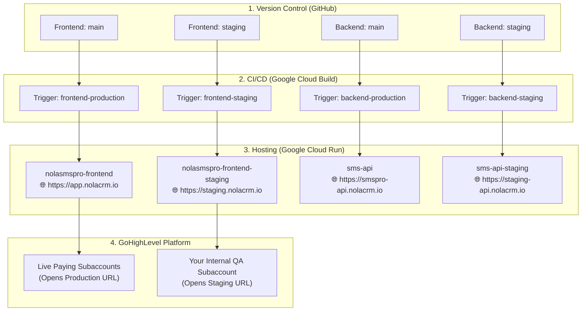
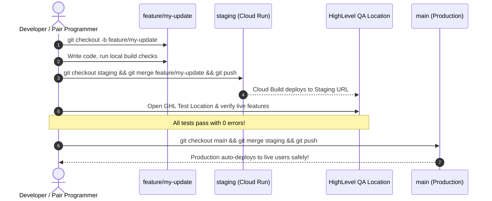

# 📘 Master Guide: Staging Environment & Safe Git Branching (Frontend & Backend)

This is the complete, step-by-step master reference for isolating your **Staging** and **Production** environments across **GoHighLevel**, **Google Cloud Run**, and **GitHub** for both **NOLA SMS Pro Frontend** and **Backend**.

---

## 📑 Table of Contents
1. [Architecture & Flow](#1-architecture--flow)
2. [Step 1: Create Staging Branches in Git](#2-step-1-create-staging-branches-in-git)
3. [Step 2: Google Cloud Build Triggers Setup](#3-step-2-google-cloud-build-triggers-setup)
4. [Step 3: Domains & URLs Mapping](#4-step-3-domains--urls-mapping)
5. [Step 4: GoHighLevel Custom Menu Link Configuration](#5-step-4-gohighlevel-custom-menu-link-configuration)
6. [Step 5: Testing Methods (Fast Local vs Staging Live)](#6-step-5-testing-methods-fast-local-vs-staging-live)
7. [Step 6: Daily Development & Release Workflow](#7-step-6-daily-development--release-workflow)
8. [Step 7: Instant Rollback & Emergency Recovery](#8-step-7-instant-rollback--emergency-recovery)

---

## 1. Architecture & Flow



---

## 2. Step 1: Create Staging Branches in Git

Run these commands in PowerShell or your terminal:

### A. Frontend Repository (`nola-sms-pro`)
```powershell
cd c:\Users\User\nola-sms-pro
git checkout main
git pull origin main
git checkout -b staging
git push -u origin staging
```

### B. Backend Repository (`nola-sms-pro-backend`)
```powershell
cd c:\Users\User\nola-sms-pro-backend
git checkout main
git pull origin main
git checkout -b staging
git push -u origin staging
```

---

## 3. Step 2: Google Cloud Build Triggers Setup

Go to [Google Cloud Console → Cloud Build → Triggers](https://console.cloud.google.com/cloud-build/triggers).

### A. Frontend Staging Trigger
1. Click **Create Trigger** (or duplicate your existing frontend trigger):
   - **Name:** `nolasmspro-frontend-staging`
   - **Event:** `Push to a branch`
   - **Repository:** `nola-repo/nola-sms-pro-frontend`
   - **Branch (regex):** `^staging$`
   - **Included files filter:** `user/**`
   - **Configuration:** `Cloud Build configuration file (YAML)`
   - **Location:** `Repository` → `user/cloudbuild.yaml`
2. Under **Substitution variables**, set:
   - `_SERVICE_NAME` = `nolasmspro-frontend-staging`
   - `_DEPLOY_REGION` = `asia-southeast1`
   - `_AR_HOSTNAME` = `asia-southeast1-docker.pkg.dev`
   - `_AR_REPOSITORY` = `cloud-run-source-deploy`
   - `_AR_PROJECT_ID` = `nola-sms-pro`
3. Click **Save**.

### B. Backend Staging Trigger
1. Click **Create Trigger** (or duplicate your existing backend trigger):
   - **Name:** `sms-api-staging`
   - **Event:** `Push to a branch`
   - **Repository:** `nola-sms-pro-backend`
   - **Branch (regex):** `^staging$`
   - **Configuration:** `Cloud Build configuration file (YAML)`
   - **Location:** `Repository` → `cloudbuild.staging.yaml`
2. Click **Save**.

---

## 4. Step 3: Domains & URLs Mapping

| Component | Production Environment | Staging Environment |
| :--- | :--- | :--- |
| **Frontend Service** | `nolasmspro-frontend` | `nolasmspro-frontend-staging` |
| **Frontend URL** | `https://app.nolacrm.io` | `https://staging.nolacrm.io`<br>*(or Cloud Run direct URL)* |
| **Backend Service** | `sms-api` | `sms-api-staging` |
| **Backend API URL** | `https://smspro-api.nolacrm.io` | `https://staging-api.nolacrm.io`<br>*(or Cloud Run direct URL)* |

### (Optional) Adding Custom Subdomains in Cloud Run:
1. In Cloud Console, go to **Cloud Run → Custom Domains**.
2. Click **Add Mapping** → Select `nolasmspro-frontend-staging` → enter `staging.nolacrm.io`.
3. Add the provided DNS CNAME record in Cloudflare / your DNS provider.

---

## 5. Step 4: GoHighLevel Custom Menu Link Configuration

To test Staging inside GoHighLevel without exposing it to live client subaccounts:

1. Open your **HighLevel Agency Dashboard** (`app.nolacrm.io`).
2. Go to **Settings → Custom Menu Links**.
3. Click **Create New Link** (or edit existing):
   - **Icon:** 🛠️ *(or any distinct icon)*
   - **Title:** `NOLA SMS Pro (Staging / QA)`
   - **URL:** `https://nolasmspro-frontend-staging-116662437564.asia-southeast1.run.app/?location_id={{location.id}}`
     *(Appending `?location_id={{location.id}}` ensures HighLevel dynamically passes the active subaccount ID to the iframe)*
   - **Show on:** **Only in selected accounts**
   - **Select Locations:** Configured for your internal testing subaccounts:
     * ✅ **DEMO**
     * ✅ **NOLACRM**
     * ✅ **NOLASMSPro**
4. Click **Save**.

> **Result:** Live paying client subaccounts only see the production app. Your internal QA subaccounts (**DEMO**, **NOLACRM**, **NOLASMSPro**) have instant access to test Staging features inside the HighLevel iframe.

---

## 6. Step 5: Testing Methods (Fast Local vs Staging Live)

### Method 1: Instant Local HMR Testing in HighLevel (via ngrok)
*Use this when writing code day-to-day to see live changes instantly inside GHL without waiting for cloud builds:*

1. Start your local frontend:
   ```bash
   cd c:\Users\User\nola-sms-pro\user
   npm run dev
   ```
2. In a second terminal, open a secure tunnel:
   ```bash
   npx ngrok http 5173
   ```
3. Copy the HTTPS forwarding URL (e.g. `https://xxxx.ngrok-free.app`).
4. In your HighLevel test location's Custom Menu Link, paste the ngrok URL.
5. You can now edit code in VS Code / IDE and watch it reload live inside the HighLevel iframe!

---

### Method 2: Staging Cloud Deployment Testing
*Use this before releasing major updates to verify the real Docker container & production build:*

1. Push your branch to `staging`.
2. Cloud Build finishes in ~1-2 minutes.
3. Open your HighLevel QA location and test:
   - Inbound / outbound 2-way SMS
   - Contact sync
   - Stats and active conversation counters
   - Credit billing and deductions

---

## 7. Step 6: Daily Development & Release Workflow



### Git Command Cheat Sheet

```powershell
# 1. Start a feature
git checkout main
git pull origin main
git checkout -b feature/my-new-feature

# 2. Work & Commit
git add .
git commit -m "feat: description of work"

# 3. Deploy to Staging for testing
git checkout staging
git pull origin staging
git merge feature/my-new-feature
git push origin staging

# 4. Release to Production (Only when 100% verified!)
git checkout main
git pull origin main
git merge staging
git push origin main
```

---

## 8. Step 7: Instant Rollback & Emergency Recovery

If an issue ever occurs in production:

### Instant 1-Click Rollback in Google Cloud Console (< 5 seconds)
1. Go to **Google Cloud Console → Cloud Run → `nolasmspro-frontend`** (or `sms-api`).
2. Click the **Revisions** tab.
3. Find the previous stable revision, click the **three dots (⋮)** → **Manage Traffic** (or click **Route 100% traffic to this revision**).
4. Click **Save**.
5. The live site instantly rolls back to the previous stable version with **zero downtime**.

### Git Rollback
```powershell
# Revert the latest merge commit
git checkout main
git revert HEAD -m 1
git push origin main
```
