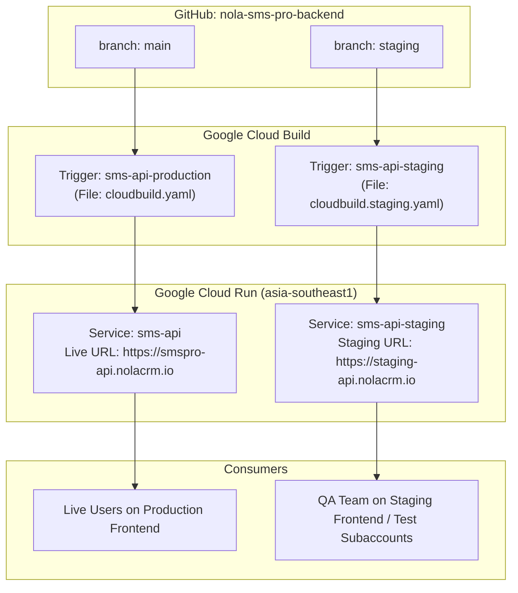
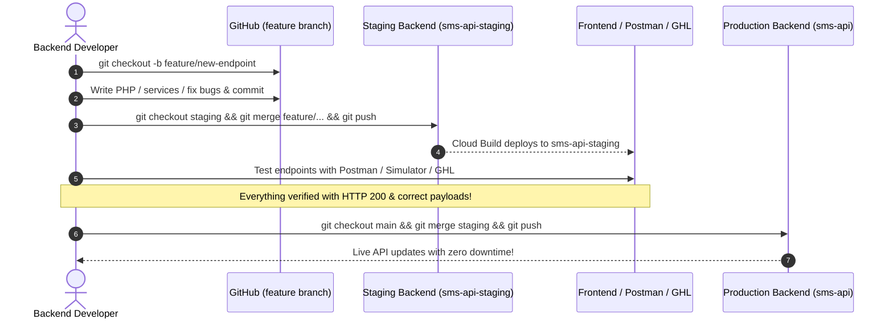

# Backend Staging Deployment & Git Branching Guide (`nola-sms-pro-backend`)

This guide explains how to set up, deploy, and manage the **Staging Backend API** (`sms-api-staging`) in Google Cloud Run alongside the **Production Backend API** (`sms-api`) without affecting live clients.

---

## 🏗️ Architecture Overview



---

## 🚀 Step 1: Create the `staging` Branch

Run in your terminal from the backend repository root:
```bash
cd c:\Users\User\nola-sms-pro-backend
git checkout main
git pull origin main
git checkout -b staging
git push -u origin staging
```

---

## ⚙️ Step 2: Set Up Cloud Build Trigger for Backend Staging

1. Open [Google Cloud Console → Cloud Build → Triggers](https://console.cloud.google.com/cloud-build/triggers).
2. Click **Create Trigger** (or **Duplicate** existing `sms-api` trigger):
   - **Name:** `sms-api-staging`
   - **Event:** `Push to a branch`
   - **Source Repository:** Select your backend repo (`nola-sms-pro-backend`)
   - **Branch (regex):** `^staging$`
   - **Configuration:** `Cloud Build configuration file (YAML)`
   - **Location:** `Repository`
   - **Cloud Build configuration file location:** `cloudbuild.staging.yaml`
3. Click **Create / Save**.

---

## 📄 Step 3: Backend Staging Build Config (`cloudbuild.staging.yaml`)

The file `cloudbuild.staging.yaml` in the backend root builds the container and deploys to `sms-api-staging`:

```yaml
steps:
  # 1. Build the container image for staging
  - name: 'gcr.io/cloud-builders/docker'
    args:
      - 'build'
      - '-t'
      - 'gcr.io/$PROJECT_ID/sms-api-staging:latest'
      - '.'

  # 2. Push to Container Registry
  - name: 'gcr.io/cloud-builders/docker'
    args:
      - 'push'
      - 'gcr.io/$PROJECT_ID/sms-api-staging:latest'

  # 3. Deploy to Cloud Run Staging Service
  - name: 'gcr.io/google.com/cloudsdktool/cloud-sdk'
    entrypoint: gcloud
    args:
      - 'run'
      - 'deploy'
      - 'sms-api-staging'
      - '--image'
      - 'gcr.io/$PROJECT_ID/sms-api-staging:latest'
      - '--region'
      - 'asia-southeast1'
      - '--platform'
      - 'managed'
      - '--min-instances'
      - '0'
      - '--max-instances'
      - '5'
      - '--concurrency'
      - '30'
      - '--memory'
      - '1Gi'
      - '--allow-unauthenticated'

images:
  - 'gcr.io/$PROJECT_ID/sms-api-staging:latest'

options:
  logging: CLOUD_LOGGING_ONLY
```

---

## 🌐 Step 4: (Optional) Map Staging Subdomain

In **Google Cloud Console → Cloud Run → Manage Custom Domains**:
- Click **Add Mapping**
- Select service `sms-api-staging`
- Enter `staging-api.nolacrm.io` (or use the automatic Cloud Run URL `https://sms-api-staging-xxxxx-as.a.run.app`)
- Add the CNAME in your DNS provider.

---

## 🔄 Step 5: Daily Development Workflow



### Git Commands Quick Reference

```bash
# 1. Start a backend task
git checkout -b feature/unisms-webhook-enhancement

# 2. Commit changes
git add .
git commit -m "feat(webhook): handle txt.received unisms events"

# 3. Deploy to Staging
git checkout staging
git merge feature/unisms-webhook-enhancement
git push origin staging

# 4. Release to Production (Only when 100% verified)
git checkout main
git merge staging
git push origin main
```
