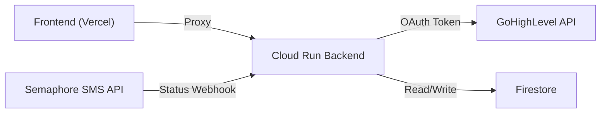
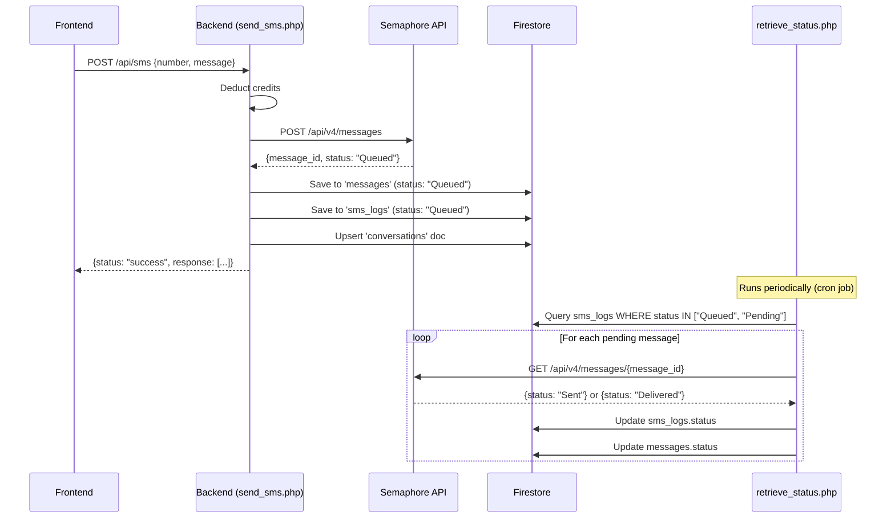

# Backend Walkthrough — NOLA SMS Pro

> For the backend team. This document covers everything needed to implement contacts CRUD, sidebar operations, and message status updates.

---

## 📐 Architecture Overview



### Routing Chain ([.htaccess](file:///c:/Users/User/.gemini/backend-repo/.htaccess))
| Frontend calls | Routes to | Purpose |
|---|---|---|
| `/api/ghl-contacts` | `api/ghl-contacts.php` | GHL contact CRUD |
| `/api/contacts` | [api/contacts.php](file:///c:/Users/User/.gemini/backend-repo/api/contacts.php) | Local Firestore contacts |
| `/api/messages` | [api/messages.php](file:///c:/Users/User/.gemini/backend-repo/api/messages.php) | Message history |
| `/api/conversations` | [api/conversations.php](file:///c:/Users/User/.gemini/backend-repo/api/conversations.php) | Sidebar conversations (rename/delete) ✅ already done |
| `/api/sms` | [api/webhook/send_sms.php](file:///c:/Users/User/nola-sms-pro/api/webhook/send_sms.php) | Send SMS |
| `/api/credits` | [api/credits.php](file:///c:/Users/User/.gemini/backend-repo/api/credits.php) | Credit balance |
| `/oauth/callback` | [ghl_callback.php](file:///c:/Users/User/.gemini/backend-repo/ghl_callback.php) | GHL OAuth callback |

---

## 1️⃣ Contacts CRUD — `api/ghl-contacts.php`

> **Currently**: Only `GET` is implemented. Need `POST`, `PUT`, `DELETE`.

### Authentication Pattern (same for all methods)

```php
// 1. Get locationId from query or header
$locationId = $_GET['locationId'] ?? $_GET['location_id'] ?? null;

// 2. Get OAuth token from Firestore
$integration = getTokenForLocation($db, $locationId);  // existing function
$accessToken = $integration['access_token'];

// 3. Headers for GHL API calls
$headers = [
    "Authorization: Bearer {$accessToken}",
    "Version: 2021-07-28",
    "Content-Type: application/json",
    "Accept: application/json",
];
```

---

### POST — Create Contact

**Frontend request:**
```
POST /api/ghl-contacts?locationId=V52Lp7YQo1ISiSf907Lu
Content-Type: application/json
X-GHL-Location-ID: V52Lp7YQo1ISiSf907Lu

{
  "name": "John Doe",
  "phone": "+639551234567",
  "email": "john@example.com"
}
```

**Backend implementation:**
```php
if ($method === 'POST') {
    $body = json_decode(file_get_contents('php://input'), true);
    
    // Split name into firstName/lastName for GHL
    $parts = explode(' ', $body['name'] ?? '', 2);
    $ghlBody = [
        'locationId'  => $locationId,
        'firstName'   => $parts[0] ?? '',
        'lastName'    => $parts[1] ?? '',
        'phone'       => $body['phone'] ?? '',
        'email'       => $body['email'] ?? '',
    ];

    $ch = curl_init('https://services.leadconnectorhq.com/contacts/');
    curl_setopt_array($ch, [
        CURLOPT_RETURNTRANSFER => true,
        CURLOPT_POST => true,
        CURLOPT_POSTFIELDS => json_encode($ghlBody),
        CURLOPT_HTTPHEADER => $headers,
    ]);
    
    $response = curl_exec($ch);
    $status = curl_getinfo($ch, CURLINFO_HTTP_CODE);
    curl_close($ch);
    
    $data = json_decode($response, true);
    $contact = $data['contact'] ?? $data;
    
    echo json_encode([
        'id'    => $contact['id'] ?? null,
        'name'  => ($contact['firstName'] ?? '') . ' ' . ($contact['lastName'] ?? ''),
        'phone' => $contact['phone'] ?? '',
        'email' => $contact['email'] ?? '',
    ]);
}
```

**Expected response:**
```json
{ "id": "abc123", "name": "John Doe", "phone": "+639551234567", "email": "john@example.com" }
```

---

### PUT — Update Contact

**Frontend request:**
```
PUT /api/ghl-contacts?locationId=V52Lp7YQo1ISiSf907Lu
Content-Type: application/json

{
  "id": "abc123",
  "name": "Jane Doe",
  "phone": "+639559876543"
}
```

**Backend implementation:**
```php
if ($method === 'PUT') {
    $body = json_decode(file_get_contents('php://input'), true);
    $contactId = $body['id'] ?? null;
    
    if (!$contactId) {
        http_response_code(400);
        echo json_encode(['error' => 'Missing contact id']);
        exit;
    }
    
    $parts = explode(' ', $body['name'] ?? '', 2);
    $ghlBody = [
        'firstName' => $parts[0] ?? '',
        'lastName'  => $parts[1] ?? '',
        'phone'     => $body['phone'] ?? '',
        'email'     => $body['email'] ?? '',
    ];

    $ch = curl_init("https://services.leadconnectorhq.com/contacts/{$contactId}");
    curl_setopt_array($ch, [
        CURLOPT_RETURNTRANSFER => true,
        CURLOPT_CUSTOMREQUEST => 'PUT',
        CURLOPT_POSTFIELDS => json_encode($ghlBody),
        CURLOPT_HTTPHEADER => $headers,
    ]);
    
    $response = curl_exec($ch);
    $status = curl_getinfo($ch, CURLINFO_HTTP_CODE);
    curl_close($ch);
    
    $data = json_decode($response, true);
    $contact = $data['contact'] ?? $data;
    
    echo json_encode([
        'id'    => $contact['id'] ?? $contactId,
        'name'  => ($contact['firstName'] ?? '') . ' ' . ($contact['lastName'] ?? ''),
        'phone' => $contact['phone'] ?? '',
        'email' => $contact['email'] ?? '',
    ]);
}
```

---

### DELETE — Delete Contact

**Frontend request:**
```
DELETE /api/ghl-contacts?id=abc123&locationId=V52Lp7YQo1ISiSf907Lu
X-GHL-Location-ID: V52Lp7YQo1ISiSf907Lu
```

**Backend implementation:**
```php
if ($method === 'DELETE') {
    $contactId = $_GET['id'] ?? null;
    
    if (!$contactId) {
        http_response_code(400);
        echo json_encode(['error' => 'Missing contact id']);
        exit;
    }

    $ch = curl_init("https://services.leadconnectorhq.com/contacts/{$contactId}");
    curl_setopt_array($ch, [
        CURLOPT_RETURNTRANSFER => true,
        CURLOPT_CUSTOMREQUEST => 'DELETE',
        CURLOPT_HTTPHEADER => $headers,
    ]);
    
    $response = curl_exec($ch);
    $status = curl_getinfo($ch, CURLINFO_HTTP_CODE);
    curl_close($ch);
    
    echo json_encode(['success' => $status === 200 || $status === 204]);
}
```

---

## 2️⃣ Sidebar — Conversations (✅ Already Implemented)

> [api/conversations.php](file:///c:/Users/User/.gemini/backend-repo/api/conversations.php) already handles rename (PUT) and delete (DELETE). 

However, the frontend currently sends sidebar CRUD calls to `/api/messages`. Two options:

### Option A — Add routing in [.htaccess](file:///c:/Users/User/.gemini/backend-repo/.htaccess) (Recommended)

The [.htaccess](file:///c:/Users/User/.gemini/backend-repo/.htaccess) already has `RewriteRule ^api/conversations$ /api/conversations.php [L]`. The frontend needs to update its endpoint calls, which we will handle.

### Option B — Add PUT/DELETE to [messages.php](file:///c:/Users/User/.gemini/backend-repo/api/messages.php)

Add to the existing [messages.php](file:///c:/Users/User/.gemini/backend-repo/api/messages.php):

```php
if ($method === 'PUT') {
    // Rename conversation
    $body = json_decode(file_get_contents('php://input'), true);
    $id   = $body['id'] ?? null;
    $name = $body['name'] ?? null;

    if (!$id || !$name) {
        http_response_code(400);
        echo json_encode(['success' => false, 'error' => 'Missing id or name']);
        exit;
    }

    $docRef = $db->collection('conversations')->document($id);
    if (!$docRef->snapshot()->exists()) {
        http_response_code(404);
        echo json_encode(['success' => false, 'error' => 'Conversation not found']);
        exit;
    }

    $docRef->update([
        ['path' => 'name',       'value' => $name],
        ['path' => 'updated_at', 'value' => new \Google\Cloud\Core\Timestamp(new \DateTime())]
    ]);

    echo json_encode(['success' => true]);
    exit;
}

if ($method === 'DELETE') {
    $conversationId = $_GET['conversation_id'] ?? $_GET['id'] ?? null;

    if (!$conversationId) {
        http_response_code(400);
        echo json_encode(['success' => false, 'error' => 'Missing conversation_id']);
        exit;
    }

    $docRef = $db->collection('conversations')->document($conversationId);
    if ($docRef->snapshot()->exists()) {
        $docRef->delete();
    }

    echo json_encode(['success' => true]);
    exit;
}
```

---

## 3️⃣ Message Status Lifecycle

This is the full lifecycle of a message status from send → delivery.

### Flow Diagram



### Status Values

| Status | Meaning | Set by |
|--------|---------|--------|
| `Queued` | Accepted by Semaphore, waiting to send | `send_sms.php` (initial) |
| `Pending` | Being processed by carrier | `retrieve_status.php` (cron) |
| [Sent](file:///c:/Users/User/nola-sms-pro/src/components/Sidebar.tsx#159-163) | Successfully sent to carrier | `retrieve_status.php` (cron) |
| `Delivered` | Confirmed delivered to device | `retrieve_status.php` (cron) |
| `Failed` | Send failed | `retrieve_status.php` (cron) |

### Frontend Status Types (what the UI expects)

```typescript
status: 'sending' | 'sent' | 'delivered' | 'failed'
```

### Firestore Collections Involved

**`messages`** — Primary collection for UI chat display
```
document ID = Semaphore message_id (string)
{
    conversation_id: "conv_09551234567",
    number: "09551234567",
    message: "Hello!",
    direction: "outbound",
    sender_id: "NOLACRM",
    status: "Queued",          // ← updated by retrieve_status.php
    batch_id: null,
    location_id: "V52Lp7...",  // ← multi-tenant scoping
    created_at: Timestamp,
    credits_used: 1
}
```

**`sms_logs`** — Legacy collection, also polled by retrieve_status.php
```
document ID = Semaphore message_id (string)
{
    message_id: "123456",
    numbers: ["09551234567"],
    message: "Hello!",
    sender_id: "NOLACRM",
    status: "Queued",          // ← updated by retrieve_status.php
    date_created: Timestamp,
    batch_id: null,
    location_id: "V52Lp7...",
    conversation_id: "conv_09551234567"
}
```

**`conversations`** — Sidebar metadata
```
document ID = "conv_09551234567" or "group_batch_xxx"
{
    id: "conv_09551234567",
    type: "direct",               // or "bulk"
    members: ["09551234567"],
    name: "John Doe",
    last_message: "Hello!",
    last_message_at: Timestamp,
    location_id: "V52Lp7...",
    updated_at: Timestamp
}
```

### `retrieve_status.php` — Current Implementation

```php
// Polls Semaphore for status updates
// Queries: sms_logs WHERE status IN ['Queued', 'Pending']
// Updates: both sms_logs AND messages collections
```

> [!IMPORTANT]
> `retrieve_status.php` needs to be running on a **cron job** (e.g., every 2-5 minutes) for statuses to update. Without it, messages will stay as "Queued" forever in the frontend.

### Cron Setup (Cloud Run / Cloud Scheduler)

```bash
# Option 1: Cloud Scheduler → Cloud Run
gcloud scheduler jobs create http update-sms-status \
  --schedule="*/2 * * * *" \
  --uri="https://smspro-api.nolacrm.io/webhook/retrieve_status" \
  --http-method=GET \
  --location=asia-southeast1

# Option 2: Traditional crontab
*/2 * * * * curl -s https://smspro-api.nolacrm.io/webhook/retrieve_status > /dev/null
```

---

## 4️⃣ Authentication Reference

All API endpoints use the same auth pattern:

```php
// From auth_helpers.php
function validate_api_request(): void {
    $receivedSecret = $_SERVER['HTTP_X_WEBHOOK_SECRET'] ?? '';
    $expectedSecret = getenv('WEBHOOK_SECRET') ?: 'f7RkQ2pL9zV3tX8cB1nS4yW6';
    if (!hash_equals($expectedSecret, $receivedSecret)) {
        http_response_code(401);
        echo json_encode(['status' => 'error', 'message' => 'Unauthorized Access']);
        exit;
    }
}

function get_ghl_location_id(): ?string {
    return $_SERVER['HTTP_X_GHL_LOCATION_ID'] 
        ?? $_GET['location_id'] 
        ?? $_GET['locationId'] 
        ?? null;
}
```

### GHL OAuth Token Retrieval

```php
// From ghl-contacts.php — getTokenForLocation()
// Collection: ghl_tokens
// Document ID: raw locationId (e.g., "V52Lp7YQo1ISiSf907Lu")
// Written by: ghl_callback.php during marketplace install

$doc = $db->collection('ghl_tokens')->document($locationId)->snapshot();
$accessToken = $doc->data()['access_token'];
```

---

## 📝 Implementation Checklist

| # | Task | File | Priority |
|---|------|------|----------|
| 1 | Add `POST` (create contact) to ghl-contacts.php | `api/ghl-contacts.php` | 🔴 High |
| 2 | Add `PUT` (update contact) to ghl-contacts.php | `api/ghl-contacts.php` | 🔴 High |
| 3 | Add `DELETE` (delete contact) to ghl-contacts.php | `api/ghl-contacts.php` | 🔴 High |
| 4 | Add `PUT` (rename conversation) to messages.php | [api/messages.php](file:///c:/Users/User/.gemini/backend-repo/api/messages.php) | 🟡 Medium |
| 5 | Add `DELETE` (delete conversation) to messages.php | [api/messages.php](file:///c:/Users/User/.gemini/backend-repo/api/messages.php) | 🟡 Medium |
| 6 | Set up cron for retrieve_status.php | Cloud Scheduler | 🟡 Medium |
| 7 | Verify [conversations.php](file:///c:/Users/User/.gemini/backend-repo/api/conversations.php) is accessible | [.htaccess](file:///c:/Users/User/.gemini/backend-repo/.htaccess) check | 🟢 Low |
