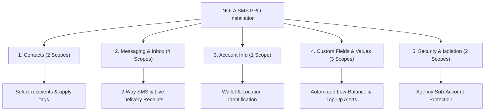

# NOLA SMS PRO – App Installation Permissions & Scopes Guide

> **Audience:** Presenters, Account Executives, Agency Partners, and End-Users  
> **Tone:** Non-Technical, Clear, and Business-Focused  
> **Last Updated:** August 2026  

---

## 1. Executive Summary & Privacy Philosophy

When users or agencies install **NOLA SMS PRO** inside HighLevel / LeadConnector CRM, the system prompts them to approve a set of permissions (known technically as OAuth scopes).

Our permission model follows the **Principle of Least Privilege**:
* We **only** request permissions strictly required to send messages, synchronize conversations, and manage account alerts.
* We **never** access private billing details, external calendars, or unrelated business data.
* For agencies managing multiple client locations, permissions are **strictly isolated** to only the sub-accounts you explicitly select during installation.

---

## 2. Quick Scope Matrix (All 12 Scopes)

| # | Permission (Scope) | Category | What It Does for the User |
| :---: | :--- | :--- | :--- |
| **1** | `contacts.readonly` | 👥 Contacts | Reads your contact list so you can choose recipients without manually retyping numbers. |
| **2** | `contacts.write` | 👥 Contacts | Updates contact details and adds tracking tags (e.g., *"SMS Sent"*, *"Alert Triggered"*). |
| **3** | `conversations.readonly` | 💬 Messaging | Displays existing conversation history so your team sees past chat context. |
| **4** | `conversations.write` | 💬 Messaging | Automatically creates a new chat thread when you message a new customer. |
| **5** | `conversations/message.readonly` | 💬 Messaging | Receives incoming SMS replies in real time directly inside your CRM. |
| **6** | `conversations/message.write` | 💬 Messaging | Sends outbound SMS and provides real-time delivery receipts (*Delivered*, *Failed*). |
| **7** | `locations.readonly` | 🏢 Account Info | Identifies the active sub-account to keep SMS wallet balances and sender IDs isolated. |
| **8** | `locations/customFields.readonly` | ⚙️ Custom Data | Reads custom data fields to trigger automated notifications (like Low Balance warnings). |
| **9** | `locations/customValues.readonly` | ⚙️ Custom Data | Reads global account-wide settings (such as company support emails or default brand names). |
| **10** | `locations/customValues.write` | ⚙️ Custom Data | Allows saving or updating global account variables across the CRM location. |
| **11** | `oauth.readonly` | 🔒 Security | Checks installed locations so agencies only activate designated client accounts. |
| **12** | `oauth.write` | 🔒 Security | Securely connects the app and immediately revokes access upon uninstall. |

---

## 3. Detailed Category Breakdown & Real-World Use Cases

---

### Category 1: Contact Management
* **Scopes Covered:** `contacts.readonly`, `contacts.write`
* **Why it matters to the user:**
  * **Seamless Recipient Selection:** When sending an SMS campaign, users don't have to copy-paste phone numbers. NOLA pulls valid phone numbers directly from your existing CRM contacts.
  * **Contact History & Tagging:** When an SMS is sent or an automated alert triggers, NOLA can tag the contact record (e.g., adding `nola-sms-sent` or cycling an alert tag), making it easy to track customer journeys and trigger follow-up workflows.

---

### Category 2: Live 2-Way Messaging & Inbox Sync
* **Scopes Covered:** `conversations.readonly`, `conversations.write`, `conversations/message.readonly`, `conversations/message.write`
* **Why it matters to the user:**
  * **Unified Communications:** Eliminates the need to switch between third-party SMS portals and your CRM. All incoming customer replies and outgoing SMS messages appear directly in the CRM's native **Conversations** tab.
  * **Auto-Thread Creation:** If you text a brand-new lead, NOLA instantly starts a chat thread so the customer record is kept up-to-date.
  * **Delivery Transparency:** Every message sent shows real-time delivery status (*Sent*, *Delivered*, or *Failed* with error descriptions), giving users confidence that their messages reached their destination.

---

### Category 3: Sub-Account & Business Profile Recognition
* **Scopes Covered:** `locations.readonly`
* **Why it matters to the user:**
  * **Location Privacy:** Ensures that each sub-account's SMS credits, Sender IDs, transaction logs, and message history remain strictly separated from other accounts.
  * **Automatic Setup:** Automatically detects the business name and timezone to ensure scheduling and account displays match your exact business settings.

---

### Category 4: Custom Fields & Custom Values
* **Scopes Covered:** `locations/customFields.readonly`, `locations/customValues.readonly`, `locations/customValues.write`
* **Why it matters to the user:**
  * **Smart Workflow Alerts:** Reads custom field IDs on your account to power automated system alerts:
    * **Low Balance Warning:** Notifies you before your SMS credit runs out.
    * **Sender ID Updates:** Alerts you when your custom Sender ID registration is approved.
    * **Top-Up Confirmation:** Confirms when your wallet has been reloaded.
  * **Account-Wide Variables:** Reads and updates global business values (such as company support links or global sender signatures) so messages remain consistent across your team.

---

### Category 5: Secure App Connection & Agency Protection
* **Scopes Covered:** `oauth.readonly`, `oauth.write`
* **Why it matters to the user:**
  * **Agency Multi-Location Control:** When an Agency installs NOLA SMS PRO, these permissions allow the agency admin to select **only** the sub-accounts they want to activate. Other client sub-accounts are never touched or modified.
  * **Clean Uninstallation:** If you decide to uninstall the app in the future, access is revoked instantly and cleanly without leaving orphan connections or background access.

---

## 4. PowerPoint Presentation (Slide-by-Slide Outline)

Here is a recommended 4-slide structure for your presentation:

### 🎞️ Slide 1: Introduction & Security First
* **Slide Title:** *NOLA SMS PRO – Installation Permissions & Data Security*
* **Bullet Points:**
  * Strict adherence to the **Principle of Least Privilege**.
  * Only requests access necessary for SMS messaging, contact tagging, and account alerts.
  * Complete sub-account data isolation for agencies and multi-location businesses.
  * 100% compliant with HighLevel / LeadConnector Marketplace standards.

---

### 🎞️ Slide 2: Core Communication (Contacts & Messaging)
* **Slide Title:** *Contacts & 2-Way Messaging Sync*
* **Bullet Points:**
  * **Contact Access (`contacts.readonly`, `contacts.write`):** Instantly select recipients and automatically tag contacts after SMS delivery.
  * **Unified Inbox (`conversations.*`, `conversations/message.*`):** Full 2-way SMS synchronization inside the native CRM inbox.
  * **Real-Time Delivery Receipts:** Live tracking of *Delivered*, *Sent*, or *Failed* message statuses.

---

### 🎞️ Slide 3: Automation & Custom Data
* **Slide Title:** *Smart Automations & Business Settings*
* **Bullet Points:**
  * **Location Profile (`locations.readonly`):** Keeps wallet balances and Sender IDs isolated to the correct business sub-account.
  * **Custom Fields (`locations/customFields.readonly`):** Powers automated system notifications (Low Balance alerts, Top-Up confirmations, Sender ID approvals).
  * **Custom Values (`locations/customValues.*`):** Connects with global CRM variables to ensure consistent branding across messages.

---

### 🎞️ Slide 4: Agency Safety & Clean Uninstall
* **Slide Title:** *Agency Protection & Secure Connection*
* **Bullet Points:**
  * **Multi-Account Safety (`oauth.readonly`):** Agencies can select designated sub-accounts without exposing other client accounts.
  * **Safe Connection (`oauth.write`):** Industry-standard encrypted authorization handshake.
  * **Instant Disconnect:** Immediate revocation of all access upon app uninstallation.

---

## 5. Word-for-Word Video Recording Script

You can read this script aloud during your video recording:

> *"Hello everyone! Today, I want to walk you through the permissions requested when installing **NOLA SMS PRO** from the Marketplace, and explain exactly why each one is needed to power your messaging experience.*
> 
> *First and foremost, we take data privacy and security very seriously. We follow the principle of least privilege, meaning we only ask for permissions that directly enable SMS communication, automated alerts, and secure account management.*
> 
> *There are 12 specific permissions covered across five key areas:*
> 
> *1. **Contact Management:** We request access to view and update contacts. This allows you to pick recipients directly from your CRM without retyping phone numbers, and automatically applies tags so you know which contacts received your messages.*
> 
> *2. **Conversations and Live Messaging:** This is the core engine of NOLA SMS PRO. These permissions power full two-way SMS, sync incoming customer replies straight into your CRM inbox in real time, and provide live delivery receipts.*
> 
> *3. **Location Details:** This safely identifies your specific business sub-account, ensuring that your SMS wallet balances, campaigns, and Sender IDs are always tied to the right business.*
> 
> *4. **Custom Fields and Values:** These permissions allow NOLA to trigger automated notifications—such as warning you when your SMS balance is running low, or confirming when a top-up or Sender ID has been approved.*
> 
> *5. **Secure Connection:** For agency owners, this provides complete control. You can choose to install NOLA on just one or two specific sub-accounts, ensuring all your other client accounts remain untouched and secure. And if you ever uninstall, all connections are revoked instantly.*
> 
> *In summary, every permission requested is designed to give you a fast, reliable, and completely integrated SMS experience while keeping your data safe and private.*
> 
> *Thank you!"*

---

## 6. Frequently Asked Questions (FAQ)

#### Q1: Does NOLA SMS PRO have access to my credit card or bank details?
**No.** NOLA SMS PRO does not request any financial, invoice, or payment gateway scopes from your CRM. All wallet top-ups are handled via secure payment gateways within NOLA's dedicated portal.

#### Q2: Can an agency install NOLA on selected sub-accounts only?
**Yes.** Thanks to the `oauth.readonly` scope, agency administrators can choose designated sub-accounts during installation. NOLA will only activate for the selected locations.

#### Q3: Why do some technical guides mention 10 scopes while this list has 12?
In recent system optimizations, the live app requirements were streamlined to **10 core scopes** (by removing custom value dependencies at runtime). However, the marketplace registry includes the **12 total scopes** to support full custom value settings. Explaining all 12 ensures complete transparency and coverage.

#### Q4: What happens when a user uninstalls the app?
Upon uninstallation, the app's OAuth token is immediately invalidated. NOLA ceases all message sending and conversation syncing for that location immediately, while preserving historical customer records safely in your CRM.
