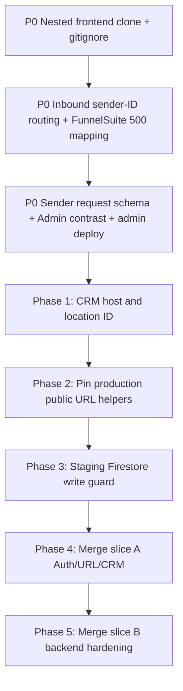

# Detailed Audit: Recent Code Changes, Incident Re-Verification & Implementation Plan

**Audit Date:** September 9, 2026 (re-verified)  
**Workspace:** `NOLA SMS PRO` (Branch: `staging`, HEAD `8cef65e` = `origin/staging` = `origin/main`)  
**Scope:** Re-verify September 8 commits, current working-tree delta, accidental nested frontend repo, FunnelSuite HTTP 500s, inbound SMS routing after the global API-key migration, and the Admin Sender Requests black/black / crash regression. Then re-rank the remaining CRM/staging roadmap.

**Canonical frontend repo (do not treat as part of this backend git tree):** `https://github.com/nola-repo/nola-sms-pro-frontend.git`  
**Canonical backend repo:** `https://github.com/nola-repo/NOLA-SMS-Pro.git`

---

## Executive Verdict

Yesterday’s two commits did what they claimed for **billing classification** and **a crash guard** on Sender Requests. They did **not** complete a safe multi-tenant cutover onto one Semaphore account.

The original audit understated three production-facing problems that are more urgent than CRM-host / staging-merge work:

1. **Accidental nested monorepo:** a full clone of `nola-sms-pro-frontend` sits at `frontend/` inside this backend workspace (its own `.git`, branch `staging`, **ahead 6** of `origin/staging`). This backend repo **already tracks** `admin/`, `user/`, and `agency/`. Untracked `docker-compose.yml` builds those copies. `.gcloudignore` already excludes `frontend/` from Cloud Build — the nested clone is a local/workspace hazard, not a Cloud Run image change, unless someone commits it.
2. **FunnelSuite 500s + inbound replies for other approved sender IDs** are the same class of failure as the API-key migration, not a separate mystery. After integrations were rewritten onto `SEMAPHORE_GLOBAL_API_KEY`, outbound and inbound both hit the **boss Semaphore account**. `receive_sms.php` still routes only by **replying phone → newest conversation**, with **no destination sender-ID lookup** and **no try/catch** around the Firestore query. That is why a previous inbound fix can look like it “came back.”
3. **Sender Requests “black/black” / crash** was only **partially** fixed in `8cef65e`. The UI no longer throws on null `requested_id`, but yesterday’s **backfill script writes `sender_id` and never `requested_id`**. The admin list API returns raw Firestore docs. Dark theme + empty sender name still renders a near-black row with an empty avatar and the label `Unknown`.

The CRM-host / staging write-guard plan in `docs/STAGING_MERGE_AND_INSTALL_CRM_REFACTOR_PLAN.md` remains valid and is **not done**. It should stay on the roadmap **after** the P0 sender/inbound/monorepo items, not instead of them.

---

## What Yesterday Actually Changed (Verified Against Git)

### Commit `3ca6060` — Sept 8 — *feat: migrate subaccounts to Semaphore Global API Key and patch billing logic*

| File | Verified? | Notes |
| --- | --- | --- |
| `api/webhook/config.php` | Yes | Adds `SEMAPHORE_GLOBAL_API_KEY` from env. |
| `api/services/SenderResolver.php` | Yes | If stored key equals global key, `using_custom_key = false` (NOLA credits apply). Still **sends** with that stored/global key when it differs from `SEMAPHORE_API_KEY`. |
| `scripts/migrate_api_keys.php` | Yes | Rewrites `nola_pro_api_key` + `semaphore_api_key` to the global key, sets `provider_preference = semaphore_custom`. Skips empty approved sender, `jnkrental`, and UniSMS. |
| `scripts/backfill_sender_requests.php` | Yes | **Schema bug:** writes `sender_id`, not `requested_id` (see P0-3). |

**Billing effect (this is the intended patch):**  
`send_sms.php` / `ghl_provider.php` bill from `using_custom_key`. Migrated FunnelSuite-class accounts no longer skip NOLA credit deduction. Insufficient credits return **402**, not 500. Uncaught provider / Firestore failures still become **500**.

**What the commit did not do:**

- Did not register or verify each alphanumeric sender on the **boss** Semaphore account.
- Did not change Semaphore inbound webhook routing (still one URL: `/webhook/receive_sms`).
- Did not look up `integrations.approved_sender_id` (or payload `receiver` / `sendername`) on inbound.
- Did not normalize inbound MSISDNs (`639…` vs `09…`) the way `receive_sms_unisms.php` does.

### Commit `8cef65e` — Sept 8 — *fix: Admin SenderRequests crash and Provider balances cache override*

| File | Verified? | Notes |
| --- | --- | --- |
| `admin/src/pages/components/SenderRequests.tsx` | Yes | `String(value \|\| '')` and `requested_id \|\| 'Unknown'`. Crash-only fix. |
| `api/admin/admin_provider_balances.php` | Yes | `?refresh=1` uses `getDashboardSummary($db)` and merge-writes `admin_config/provider_balance_summary`. |
| `admin/package-lock.json` | Yes | 17 lines **removed** (lockfile churn, unrelated to the UI bug). |

Production Admin Cloud Run only picks this up after an **admin image deploy**. Backend `8cef65e` on `sms-api` does not update `admin.nolasmspro.com` by itself.

### Uncommitted (Sept 9 working tree)

| Path | Status | Action |
| --- | --- | --- |
| `api/services/providers/SemaphoreProvider.php` | Maps HTTP 408 **and** 5xx to `SemaphoreTimeoutException` (retryable) | Reasonable hardening; **does not fix** NOLA returning 500 to GHL. Do not treat as the FunnelSuite fix. |
| `scripts/verify_migration.php` | **Do not commit as-is** | Contains a **hardcoded full Semaphore API key**. Move to env; rotate the key if this file was copied or logged. |
| `docker-compose.yml` | Untracked | Local stack building **this repo’s** `admin` / `user` / `agency` copies. Do not add the nested `frontend/` clone. |
| `frontend/` | Untracked nested git repo | Remove from this workspace (see P0-1). |
| `docs/*.md`, `.agents/rules/daily-task-reporting.md` | Untracked docs | Fine to keep; not runtime. |
| `api/cache/data/*.cache` | Dirty | Ignored by `.gitignore` intent; do not commit. |

---

## P0-1 — Accidental Nested Frontend Repo (Not a True Monorepo Merge)

### Facts

- This backend repository **already contains tracked SPAs:** `admin/` (52 files), `user/` (119), `agency/` (60). That duplication vs `nola-sms-pro-frontend` predates Sept 8 (admin history goes back to `9b55ab8`).
- `frontend/` is a **second complete git repo** (`frontend/.git`) pointing at `nola-sms-pro-frontend`, currently `staging...origin/staging [ahead 6]`.
- Nested `frontend/.gitignore` already excludes `NOLA-SMS-Pro-Backend/` — the teams have nested these repos both ways before.
- Cloud Build for PHP is protected: `.gcloudignore` lists `frontend/` and `_nola-sms-pro-frontend/`.
- Untracked `docker-compose.yml` uses `./admin`, `./user`, `./agency` (backend copies), **not** `./frontend/admin`.

### Risk

- Committing `frontend/` would balloon this repo and fight the real frontend remote.
- Edits in the wrong tree (`NOLA SMS PRO/admin` vs `NOLA SMS PRO/frontend/admin`) explain “I fixed Sender Requests but production still looks broken.”
- `8cef65e` patched **this** repo’s `admin/src/.../SenderRequests.tsx`. The nested frontend copy is a parallel file; they can drift.

### Recommended fix (ops, not a product feature)

1. Do **not** `git add frontend/` or merge the nested repo into backend `staging`.
2. Copy any unique unpushed commits from `frontend/` (it is **ahead 6**) into the standalone frontend clone, push there, then delete `NOLA SMS PRO/frontend`.
3. Add `/frontend/` to backend `.gitignore` so a future clone cannot sneak in.
4. Treat `docker-compose.yml` as optional local DX; if committed, document that frontend **source of truth** remains `nola-sms-pro-frontend`, and these folders are deployable snapshots only.
5. Longer term: stop committing SPA source in the backend repo; Cloud Build already builds admin/user/agency as separate services from the frontend repo.

---

## P0-2 — FunnelSuite HTTP 500s and Inbound SMS After Global Key Migration

### Why this is tied to yesterday’s migration

Before migration, a subaccount with its **own** Semaphore key (`using_custom_key = true`) sent on **that** Semaphore project. Inbound webhooks, sender registrations, and balance lived on **that** project.

`migrate_api_keys.php` copied the **boss** key onto every non-UniSMS integration with an `approved_sender_id` (except `jnkrental`) and set `provider_preference = semaphore_custom`. `SenderResolver` then:

- Treats the key as **not** custom for **billing** (`using_custom_key = false`) when it matches `SEMAPHORE_GLOBAL_API_KEY`.
- Still uses that key for **dispatch** when it is not equal to `SEMAPHORE_API_KEY`.

All of those sender IDs (FunnelSuite and every other migrated brand) now send **and receive** on the **same** Semaphore account whose webhook is `https://smspro-api.nolacrm.io/webhook/receive_sms`.

That is the correct architecture **only if** inbound routing is **sender-ID (or `to`) first**. It is not.

### Current inbound path (`api/webhook/receive_sms.php`)

1. Auth via `validate_api_request()`.
2. Parse JSON; `$senderNumber = $data['sender']` with **no digit normalization**.
3. Query `conversations` where `members` array-contains that exact string, `orderBy last_message_at DESC`. Composite index for this query **exists** in `firestore.indexes.json`.
4. **No** read of Semaphore destination / `receiver` / `sendername`.
5. If zero conversations: log + `ignored` / `unmapped_sender` (HTTP 200 via `exit(json_encode(...))`).
6. Else keep **only the newest** conversation (`array_slice(..., 0, 1)`).
7. There is **no try/catch** around the query. A Firestore/auth/timeout exception becomes an **uncaught 500**. Semaphore will retry → “frequent 500s.”
8. GHL sync runs after an early flush; sync failures are logged, not returned as 500.

UniSMS inbound (`receive_sms_unisms.php`) still uses the same **phone → newest conversation** model. The 2-way audit (`docs/2WAY_SMS_AUDIT_IMPLEMENTATION_HANDOFF.md`) already said this is wrong for multi-tenant receive. Semaphore alphanumeric 2-way has the same requirement: **route by which sender ID (or virtual number) was replied to**, then by phone under that location.

### Why FunnelSuite (and any other registered sender) can 500 or “lose” inbound

| Symptom | Likely mechanism after migration |
| --- | --- |
| GHL / app send returns **500** | Provider throw in `send_sms.php` (e.g. sender name **not registered on the boss account**, Semaphore 4xx/5xx not mapped to a clean 4xx). Catch around line 1206 / 1253 returns 500. |
| Conversation Provider send “fails” in GHL | `ghl_provider.php` tries to 200 early, then send in background. If validation/billing throws **before** flush, GHL sees 500. |
| Frequent **500 on `/webhook/receive_sms`** | Uncaught exception on conversation query or auth/config; Semaphore retries. |
| Inbound never appears for FunnelSuite | Reply hits boss webhook; phone not in `conversations.members` in that exact format; message **dropped** (200 ignored). Previously the custom-key project’s webhook may have been unused or routed differently. |
| Inbound lands on the **wrong** subaccount | Same contact messaged by two locations; newest conversation wins. Shared global webhook makes this **all senders**, not one account. |
| “I fixed this before and it came back” | Earlier work (`e8a4959` fan-out inbound, `c488d42` unique conversation routing) still does **not** bind inbound to `approved_sender_id`. Migrating keys **changes which Semaphore account delivers the webhook**, so a phone-only matcher that “worked” on a quiet custom account fails on the busy boss account. |

### Billing vs 500 (do not confuse these)

- Migrated FunnelSuite now **consumes NOLA credits**. Zero balance → **402** `insufficient_credits`.
- That is expected after `3ca6060`. It is **not** the same as HTTP 500.
- If FunnelSuite previously used a **customer-paid** Semaphore key, they may now be billed twice in spirit (NOLA wallet + boss Semaphore balance). Confirm product intent.

### Required inbound + outbound hardening (implement next)

**Inbound (must ship before more sender IDs share the boss key):**

1. Log a redacted inbound payload (keys only) so we know Semaphore’s field names (`sender`, `receiver`, `network`, `sendername`, etc.).
2. Resolve `location_id` in this order:
   1. Destination sender name / receiver → `integrations` where `approved_sender_id` (case-insensitive) matches, plus `sender_id_requests` approved rows (`requested_id` **or** `sender_id`).
   2. Else conversation by **normalized** phone (`09` / `639` / `9`) **scoped to that location**.
   3. Else drop (200 ignored) — never guess another tenant.
3. Wrap the handler in try/catch; always return JSON 200 to Semaphore on handler bugs after logging (or 5xx only if you want retries — today retries amplify outages).
4. Apply the same destination-first rule to any other registered sender, not FunnelSuite only.

**Outbound FunnelSuite 500s:**

1. Confirm `FunnelSuite` (exact spelling) exists on the **boss** Semaphore sender list.
2. Confirm Cloud Logging for `location_id` of FunnelSuite: `SenderResolver` JSON, `BILLING DECISION`, Semaphore HTTP body.
3. Map Semaphore “invalid sender” / 4xx to a **422/400** with a stable `error` code; reserve 500 for unexpected exceptions.
4. Keep the uncommitted 5xx→timeout mapping only after confirming retry queue will not **double-send**.

---

## P0-3 — Sender Requests Crash, `Unknown` Rows, and Black-on-Black

### Two bugs, one migration

**A. Runtime crash (partially fixed in `8cef65e`)**  
`requested_id.substring(...)` threw when `requested_id` was null. Defensive `String(...)` stops the ErrorBoundary. That is the “black screen” crash path (`ErrorBoundary` uses a dark card on `dark:bg-[#0f1117]`). If production Admin was not redeployed, the crash **still** happens there.

**B. Data + contrast (not fixed)**  

`scripts/backfill_sender_requests.php` writes:

```php
'sender_id' => $approvedSenderId,
'status' => 'approved',
// no requested_id, no requested_id_lower, no location_name
```

`api/admin/admin_sender_requests.php` GET `sender_requests` returns **raw** documents. UI still reads `req.requested_id` only.

Result after backfill `--apply`:

- Rows titled **Unknown**
- Avatar initials empty (`''.substring(0, 2)`)
- Dark theme: `dark:bg-[#111214]` row on `dark:bg-[#09090b]` page (`AdminLayout`) → **black on black**
- Approve/revoke paths that write `$reqData['requested_id']` can persist **null** `approved_sender_id`
- `nola_sender_has_other_approved_request()` only inspects `requested_id`, so backfilled names are invisible to master-sender cleanup

`8cef65e` made the page **not crash**. It did **not** restore sender names.

### Required fix

1. Normalize in the admin list API:  
   `requested_id = requested_id ?: sender_id ?: sender_name ?: sendername`
2. Patch backfill to set `requested_id`, `requested_id_lower`, `provider`, timestamps; re-run for already-written docs.
3. Frontend: one helper `displaySenderId(req)` used for label, initials, and char count; never render an empty 10×10 dark tile.
4. Contrast: row background should stay `dark:bg-[#1a1b1e]` or include a visible border; do not rely on `font-black` (font-weight 900) for color.
5. Deploy **admin** Cloud Run from the frontend pipeline (or this repo’s `admin/` snapshot — pick one source of truth).
6. Bust `NolaCache` key `admin_sender_requests_list_*` after backfill.

---

## Corrections to the Draft Audit You Pasted

| Draft claim | Re-verified |
| --- | --- |
| Yesterday’s work was “migration + admin crash + balances” | True, but **incomplete**. Inbound routing, backfill schema, nested `frontend/`, and FunnelSuite 500s were missing. |
| SenderResolver change is only a billing patch | Also changes **who pays**. Dispatch still uses the stored/global key if it ≠ `SEMAPHORE_API_KEY`. |
| SenderRequests is “fixed” | Crash guarded; **Unknown + dark contrast + approve-null** remain. |
| UniSMS 422 and keep-warm 404 are the top leftovers | They remain open, but **below** P0 sender/inbound/monorepo. |
| `frontend/agency/nginx.conf` still needs `Authorization` CORS | **Already present** in both `agency/nginx.conf` and nested `frontend/agency/nginx.conf`. Do not list as unfinished. |
| PHPUnit / Laravel suite as verification for migration | This app is not a Laravel HTTP suite for webhooks; `php scripts/verify_migration.php` must **not** run until the hardcoded key is removed. |
| Default CRM host in Phase 1 | Current `install_detect_crm_base_url()` still defaults to **`https://app.nolacrm.io`** (or `GHL_CRM_BASE_URL`). Plan’s “default gohighlevel for marketplace” is **not implemented**. |
| `GHL_MARKETPLACE_LOC_ID` | Still hardcoded `ugBqfQsPtGijLjrmLdmA` in `pages/install-register.php` (~line 663). |
| Production OAuth pin when `K_SERVICE=sms-api` | **Not implemented.** `nola_ghl_oauth_redirect_uri()` uses `GHL_REDIRECT_URI` or request host. |
| Staging location write guard | **Not implemented.** `nola_is_staging()` exists; `STAGING_ALLOWED_LOCATION_IDS` does not. |

---

## User Review Required (unchanged product questions)

> **Staging CRM host & location ID**  
> Installs must return users to **their** HighLevel location on `app.nolacrm.io` vs `app.gohighlevel.com`. Confirm extra white-label agency hosts for the allowlist.

> **Staging write guard**  
> Staging shares Firestore with production. `STAGING_ALLOWED_LOCATION_IDS` must block QA from overwriting paying `ghl_tokens`.

**New review items from this re-verify:**

> **Boss-key product intent**  
> Confirm every migrated sender (except UniSMS / `jnkrental`) should bill **NOLA credits** and send on the **boss** Semaphore account. If FunnelSuite was meant to keep a customer key, restore that integration and exclude it from migrate.

> **Semaphore inbound field**  
> Confirm which JSON field is the destination sender ID on the live webhook. Implementation should not guess.

---

## Open Questions (re-ranked)

1. **P0:** Is FunnelSuite’s sender registered on the **global** Semaphore account? (If no, outbound 4xx/5xx is expected.)
2. **P0:** Was `backfill_sender_requests.php --apply` run on production Firestore? (If yes, expect `Unknown` rows until schema patch.)
3. **P0:** Which Admin build is live — backend-tracked `admin/` or `nola-sms-pro-frontend`? Did `8cef65e` get an admin deploy?
4. UniSMS HTTP 422 hyperlinks: still recommend **pre-billing 422** (already largely in `send_sms.php` via `UniSmsProvider::containsLink`). Do not auto-fallback to Semaphore.
5. Delete `firebase-schedule-keepWarm-asia-southeast1` (orphan 404 every 4 minutes). Unrelated to FunnelSuite.

---

## Revised Implementation Roadmap

Do **not** start CRM-host merge slices until P0 is closed on staging + production.



### P0-A — Stop the nested repo

- Delete workspace `frontend/` after preserving its 6 unpushed commits on the real frontend remote.
- `.gitignore`: `/frontend/`
- Never commit `scripts/verify_migration.php` with a live key.

### P0-B — Shared-key inbound + FunnelSuite errors

Files: `api/webhook/receive_sms.php`, `api/services/SenderResolver.php` (read-only lookup helper), optional `integrations` query by `approved_sender_id`, `send_sms.php` / `ghl_provider.php` error mapping.

Acceptance:

- Reply to **FunnelSuite** is stored and GHL-synced under FunnelSuite’s `location_id` even if the same phone exists on another account.
- Same for at least one other migrated sender ID.
- `/webhook/receive_sms` does not 500 on empty/malformed payloads.
- Invalid sender on Semaphore returns 4xx with `error` code, not a generic 500.

### P0-C — Sender Requests data + UI

Files: `api/admin/admin_sender_requests.php`, `scripts/backfill_sender_requests.php`, `admin/src/pages/components/SenderRequests.tsx` (and the **frontend repo** copy if that is what Cloud Build uses).

Acceptance:

- Every backfilled row shows the real sender name in light and dark mode.
- Approve does not write null `approved_sender_id`.
- No ErrorBoundary on `/requests`.

### Phase 1 — HighLevel CRM host & location ID (unchanged intent)

Still required; **not** done.

- `install_detect_crm_base_url()`: state → Referer/Origin → GHL location payload → stored `ghl_tokens.crm_domain` → marketplace default `https://app.gohighlevel.com` (not `app.nolacrm.io`).
- Persist `crm_domain` on `ghl_tokens/{locationId}`.
- `install-login.php` / `install-register.php`: deep link only the **resolved** location; remove `GHL_MARKETPLACE_LOC_ID` fallback.

### Phase 2 — Production-safe public URL helpers

- Pin `https://smspro-api.nolacrm.io/oauth/callback` when `K_SERVICE=sms-api` if `GHL_REDIRECT_URI` unset.
- Staging stays host-based. Do not copy production URL env onto `sms-api-staging`.

### Phase 3 — Staging write guard

- `STAGING_ALLOWED_LOCATION_IDS` when `nola_is_staging()`; refuse `ghl_tokens` writes for other IDs.

### Phase 4–5 — Merge slices

Unchanged from `docs/STAGING_MERGE_AND_INSTALL_CRM_REFACTOR_PLAN.md`: slice A = auth/URL/CRM; slice B = GET hardening / credit retry / GHL status PUT.

### Phase 4 ops leftovers (lower)

- Delete orphan keep-warm scheduler job.
- Agency CORS `Authorization` is **already** in nginx; skip unless a different vhost is live without it.
- `agency/nginx.conf` still **hardcodes** `X-Webhook-Secret` and proxies **production** API even for local compose — rotate if this file is public; point compose at local `api` instead.

---

## Verification Plan (Updated)

### Do not run until safe

- `php scripts/verify_migration.php` — **blocked** until the hardcoded key is removed and the script reads `SEMAPHORE_GLOBAL_API_KEY` from env.

### Automated / CLI

- `php scripts/migrate_api_keys.php --dry-run` (compare exclusions: UniSMS, `jnkrental`).
- After schema fix: `php scripts/backfill_sender_requests.php --dry-run` then `--apply` once.
- Confirm Firestore: sample integration `nola_pro_api_key` matches global; FunnelSuite `approved_sender_id` non-empty.

### Manual — FunnelSuite / inbound

1. Cloud Logging: filter `searchPayload` / `receive_sms` / FunnelSuite `location_id` for 500 vs 402 vs ignored.
2. Send SMS from FunnelSuite → reply from a handset → message appears **only** on FunnelSuite.
3. Repeat with a second migrated sender ID and a phone that exists on two accounts.

### Manual — Admin Sender Requests

1. Light and dark theme on `/requests`.
2. Backfilled rows show real names, not Unknown.
3. Expand modal: char count matches the name.
4. Confirm live Admin deploy hash includes `8cef65e` **and** P0-C API mapping.

### Manual — CRM/staging (after P0)

Same table as `docs/STAGING_MERGE_AND_INSTALL_CRM_REFACTOR_PLAN.md` (install deep link host + location; never `ugBqfQsPtGijLjrmLdmA` unless that location actually installed).

---

## Summary

| Priority | Item | Sept 8 status | Sept 9 re-verify |
| --- | --- | --- | --- |
| P0 | Nested `frontend/` git repo | Not in original audit | Confirmed; do not commit |
| P0 | Global key migration | Shipped `3ca6060` | Billing flag OK; inbound/sender-on-boss account **not** designed |
| P0 | FunnelSuite 500 + other inbound | Not in original audit | Explained by shared webhook + phone-only routing + possible unregistered sender / uncaught 500 |
| P0 | Sender Requests UI | Crash guard `8cef65e` | Backfill missing `requested_id` + dark contrast remain |
| P1 | CRM host / location deep link | Plan only | Code still defaults to `app.nolacrm.io` + HQ location constant |
| P1 | Staging token write guard | Plan only | Not implemented |
| P2 | UniSMS 422, keep-warm 404 | Open questions | Still valid, not FunnelSuite |
| P2 | Semaphore 5xx → timeout | Uncommitted | Optional retry helper only |
