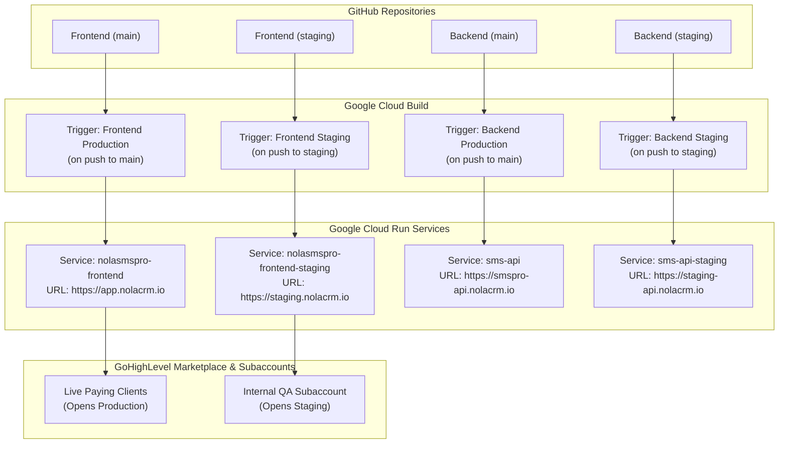
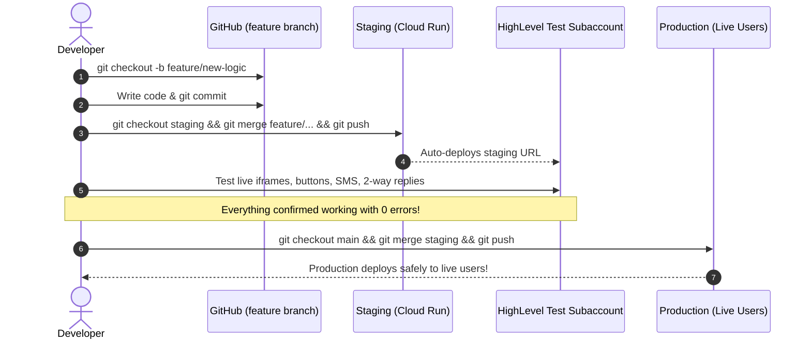

# End-to-End Staging Deployment & Git Branching Guide (Frontend & Backend)

This document provides a complete guide for setting up and managing a isolated **Staging Environment** across Google Cloud Run and GitHub for both **Frontend** (`nola-sms-pro-frontend`) and **Backend** (`nola-sms-pro-backend`) so you can test features inside GoHighLevel without affecting active users.

---

## 🏗️ Architecture Overview



---

## 🚀 Part 1: Create `staging` Branches in Git

### 1. Frontend Repository (`nola-sms-pro`)
Run the following in powershell/terminal:
```bash
cd c:\Users\User\nola-sms-pro
git checkout main
git pull origin main
git checkout -b staging
git push -u origin staging
```

### 2. Backend Repository (`nola-sms-pro-backend`)
Run the following in powershell/terminal:
```bash
cd c:\Users\User\nola-sms-pro-backend
git checkout main
git pull origin main
git checkout -b staging
git push -u origin staging
```

---

## ⚙️ Part 2: Set Up Google Cloud Build Triggers

Go to [Google Cloud Console → Cloud Build → Triggers](https://console.cloud.google.com/cloud-build/triggers).

### 1. Frontend Staging Trigger (`nolasmspro-frontend-staging`)
1. Click **Create Trigger** (or **Duplicate** existing frontend trigger):
   - **Name:** `nolasmspro-frontend-staging`
   - **Event:** `Push to a branch`
   - **Source Repository:** `nola-repo/nola-sms-pro-frontend`
   - **Branch:** `^staging$`
   - **Included files filter:** `user/**`
   - **Configuration:** `Cloud Build configuration file (YAML)`
   - **Location:** `Repository` → `user/cloudbuild.yaml`
2. Under **Substitution variables**, set:
   - `_SERVICE_NAME` = `nolasmspro-frontend-staging`
   - `_DEPLOY_REGION` = `asia-southeast1`
   - `_AR_HOSTNAME` = `asia-southeast1-docker.pkg.dev`
   - `_AR_REPOSITORY` = `cloud-run-source-deploy`
   - `_AR_PROJECT_ID` = `nola-sms-pro`
3. Click **Create**.

---

### 2. Backend Staging Trigger (`sms-api-staging`)
1. Click **Create Trigger** (or **Duplicate** existing `sms-api` trigger):
   - **Name:** `sms-api-staging`
   - **Event:** `Push to a branch`
   - **Source Repository:** `nola-sms-pro-backend`
   - **Branch:** `^staging$`
   - **Configuration:** `Cloud Build configuration file (YAML)`
   - **Location:** `Repository` → `cloudbuild.staging.yaml`
2. Click **Create**.

---

## 🔗 Part 3: HighLevel Custom Menu Link Setup

Once Cloud Run deploys the staging frontend:
1. Copy the staging Cloud Run URL (e.g. `https://nolasmspro-frontend-staging-xxxxx-as.a.run.app` or `https://staging.nolacrm.io`).
2. Go to **GoHighLevel Agency Settings → Custom Menu Links**.
3. Click **Add Link**:
   - **Title:** `NOLA SMS Pro (Staging / QA)`
   - **URL:** Your staging URL
   - **Icon:** 🛠️ / 💬
   - **Show on:** **Only in selected locations** → Check **ONLY your internal test location**.
4. Click **Save**.

Now, only you and your QA team can see the Staging icon inside your test subaccount, while your live paying clients only see the production app!

---

## 🔄 Part 4: Daily Developer Workflow



### Commands Cheat Sheet

| Step | Action | Git Command |
| :--- | :--- | :--- |
| **1** | Start a new feature or fix | `git checkout -b feature/my-feature` |
| **2** | Commit your progress | `git add .`<br>`git commit -m "feat: description"` |
| **3** | Deploy to Staging | `git checkout staging`<br>`git merge feature/my-feature`<br>`git push origin staging` |
| **4** | Test in HighLevel | Open your test location in GHL and verify live functionality |
| **5** | Release to Production | `git checkout main`<br>`git merge staging`<br>`git push origin main` |
