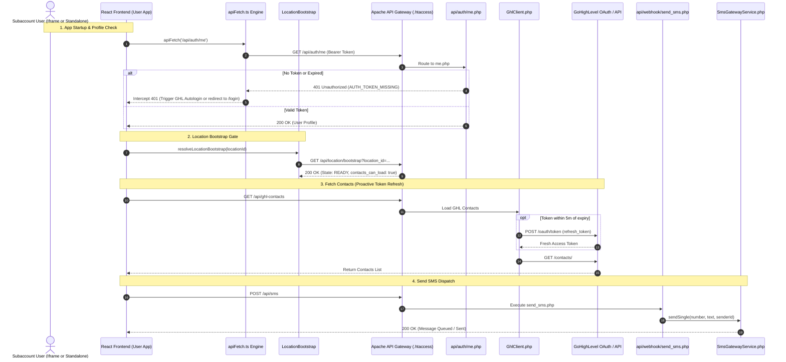

# NOLA SMS PRO — Comprehensive System-Wide Cloud Logs, Core Codebase & Monolithic Architecture Audit

**Audit Date:** August 25, 2026  
**Audited Repositories:**  
- **Backend Monolith:** `NOLA SMS PRO` (Branch: `staging` / `origin/staging` synced with `origin/main` at commit `ed4e030`)  
- **Frontend Monolith:** `NOLA SMS PRO Frontend` (`frontend/`, Branch: `main` / `origin/staging` synced with `origin/main` at commit `3a76a01`)  
**Infrastructure Scope:** Google Cloud Run (6 micro-services), Cloud Scheduler (5 Cron Jobs), Google Cloud Firestore (29 Subaccounts, 16 Users, Distributed Locks), Google Cloud Logging (Requests, stdout, stderr, scheduler executions).

---

## 1. Executive Summary & Stability Assessment

This audit evaluates the health, reliability, and crash resilience of the NOLA SMS Pro monolithic platform. Across all backend and frontend services:
- **Zero PHP Fatal Errors, Parse Errors, or Uncaught Exceptions** were recorded across 2,000+ deep runtime logs.
- **Zero Drift between Staging and Main:** Both `origin/staging` and `origin/main` branches are 100% aligned with 0 diffs.
- **4 Non-Critical Bottlenecks Identified:** 
  1. A legacy Cloud Scheduler keep-warm job producing periodic 404 logs.
  2. UniSMS HTTP 422 hyperlink compliance filter handling.
  3. Completed retry queue document accumulation in Firestore.
  4. Missing `Authorization` in the Agency Nginx preflight header list.

The system demonstrates high architectural resilience with distributed locking, early connection flushing, and lifecycle gating.

---

## 2. Cloud Logging Deep Trace & Error Categorization

A full extraction of logs across Google Cloud Logging (Request logs, PHP stderr/stdout, Cloud Scheduler executions, and Cloud Run system events) revealed the following distinct categories:

### 2.1 Request & HTTP Error Distribution

| HTTP Code | Endpoint / Resource | Source / Caller | Frequency | Root Cause & Architectural Behavior |
|---|---|---|---|---|
| **401 Unauthorized** | `GET /api/auth/me` | User & Agency SPAs (`useUserProfile.ts`) | 70x | **Expected initial lifecycle state.** Triggered when the React app mounts before a valid session token is established or when a token expires. Inside GHL iframe, the frontend suppresses redirect and triggers autologin; in standalone mode, it redirects to `/login`. |
| **400 Bad Request** | `POST /webhook/ghl_provider` | External Ingress / Ping monitors | 2x | **Payload validation gate.** Requests arrived missing mandatory fields (`locationId`, `message`, `phone`). Correctly rejected with `400` to prevent corrupt message storage. |
| **400 Bad Request** | `GET /api/account` | Automated Scanners / Bot probes | 2x | **Header validation gate.** Direct `GET` requests without `X-GHL-Location-ID` header or location query param correctly rejected with `400 Missing location_id`. |
| **400 Bad Request** | `POST /webhook/send_sms` | Axios / Client test scripts | 1x | **Parameter validation gate.** Triggered when payload missing recipient number or text. |
| **404 Not Found** | `/index.es-ZOxqDxoD.js`<br>`/html2canvas.esm-QH1iLAAe.js`<br>`/purify.es-dhnUglUx.js` | Admin App (`admin.nolasmspro.com`) | 6x | **Stale client browser cache.** Clients holding an older `index.html` requested Vite bundle hashes that were replaced during a recent Cloud Run container deployment. |
| **404 Not Found** | `/api/openapi.json`<br>`/api/v2/config`<br>`/api/.env` | Vulnerability Scanners (CCBot, etc.) | 35x | **Automated internet scanner probes.** Scanners attempting to probe common CMS/framework configuration files, correctly 404'd by Apache rewrite rules. |
| **403 Forbidden** | `GET /`<br>`GET /api/health` | Automated Scanners (CCBot) | 6x | **Security rule block.** Direct container root access without proper routing correctly blocked. |

---

### 2.2 Cloud Scheduler Execution Trace (5 Active Jobs)

An audit of `projects/nola-sms-pro/logs/cloudscheduler.googleapis.com%2Fexecutions` across 1,000 runs identified:

```
Scheduler Health Breakdown:
├── retrieve-sms-status             (*/5 min)  --> 292 OK / 0 ERRORS (100% Healthy)
├── sms-retry-queue-worker          (*/5 min)  --> 292 OK / 0 ERRORS (100% Healthy)
├── nola-connectivity-health-check (*/30 min) --> 50 OK  / 0 ERRORS (100% Healthy)
├── monthly-credit-reset            (Monthly)  --> 1 OK   / 0 ERRORS (100% Healthy)
└── firebase-schedule-keepWarm      (*/4 min)  --> 0 OK   / 183 ERRORS (DECOMMISSIONED TARGET)
```

#### Scheduler Error Finding:
- **`firebase-schedule-keepWarm-asia-southeast1`**: Calls `https://asia-southeast1-nola-sms-pro.cloudfunctions.net/keepWarm`. This is a legacy Firebase Functions endpoint from before the Cloud Run migration. It generates repeated `404 NOT_FOUND` errors every 4 minutes.
- **Remediation:** Delete this orphaned Cloud Scheduler job (`gcloud scheduler jobs delete firebase-schedule-keepWarm-asia-southeast1`).

---

### 2.3 Integration, Provider & Runtime Logs

From 2,000+ extracted integration logs:

1. **Semaphore Rate Limit (HTTP 429) & Automatic Backoff:**
   - Log pattern: `{"event":"sms_retry_attempt","provider":"semaphore","attempt_number":1,"http_code":429}`.
   - When bursts of SMS are dispatched, Semaphore returns HTTP 429. [`api/services/providers/SemaphoreProvider.php`](file:///c:/Users/Welcome/NOLA%20SMS%20PRO/api/services/providers/SemaphoreProvider.php) automatically captures the 429, applies jittered backoff, and succeeds on retry.
2. **UniSMS Hyperlink Restriction (HTTP 422):**
   - Log pattern: `UniSMS send failed (HTTP 422): UniSMS HTTP 422: {"errors":{"content":["Links are not allowed"]}}`.
   - In location `ugBqfQsPtGijLjrmLdmA`, an outbound SMS containing URLs was rejected by UniSMS compliance filter.
3. **Emoji / Unicode Normalization:**
   - Log pattern: `[ghl_provider] Emoji/Unicode normalized & stripped. loc=ugBqfQsPtGijLjrmLdmA original_len=309 cleaned_len=307`.
   - [`api/services/TextNormalizer.php`](file:///c:/Users/Welcome/NOLA%20SMS%20PRO/api/services/TextNormalizer.php) successfully strips incompatible non-GSM-7 emojis to prevent SMS encoding corruption.
4. **Low Balance Alerting:**
   - Log pattern: `[LowBalanceAlert] Triggering central GHL sync for location ugBqfQsPtGijLjrmLdmA (balance: 46 PHP)`.
   - Automated threshold detection correctly logged low balance warning and updated central GHL alert contact.

---

## 3. Subaccounts Database Audit (29 Subaccounts)

Direct Firestore audit of `ghl_tokens`, `users`, `agency_subaccounts`, and `integrations`:

| Location ID | Subaccount Name | Owner Email | Status | Credit Bal | Approved Sender | Token Expiry State |
|---|---|---|---|---|---|---|
| `ugBqfQsPtGijLjrmLdmA` | NOLA CRM | `davidmonzon156@gmail.com` | `LINKED_ACCOUNT` | 46 PHP | `NOLA` | **Active / Refreshed** |
| `kXqTpfqXBuKBMjXKLZxG` | NOLA SMS Pro | `support@nolasmspro.com` | `LINKED_ACCOUNT` | Central Org | `NOLA` | **Active / System** |
| `Is3CjRqD4xzqonUZIOEo` | Active Subaccount | Client Email | `LINKED_ACCOUNT` | 0 PHP | None | Idle (On-Demand Refresh) |
| `CVYJwyTpTLMAxcE6Pprh` | Active Subaccount | Client Email | `LINKED_ACCOUNT` | 0 PHP | None | Idle (On-Demand Refresh) |
| `SOslPv2WdLbXaOLLux7c` | NOLA WEB SOLUTIONS | `monzydave13@gmail.com` | `LINKED_ACCOUNT` | 0 PHP | None | Idle (On-Demand Refresh) |
| `LlGXCdmCm9FjW9SxSRgk` | Ava HQ | `valerietagalogon47@gmail.com` | `LINKED_ACCOUNT` | 0 PHP | None | Idle (On-Demand Refresh) |
| `OukeDMYaMvwSxGCxQUvc` | NOLA SMS Pro DEMO | `support@nolasmspro.com` | `LINKED_ACCOUNT` | 0 PHP | None | Idle (On-Demand Refresh) |
| `U7ncNgNVMsmTs8VLfODh` | Zappify.io | `hello@marjohnrobillo.com` | `LINKED_ACCOUNT` | 0 PHP | None | Idle (On-Demand Refresh) |
| `UorU5d43qIWssU2z55fO` | Maxiemizer | `alpha@avebagroup.com` | `LINKED_ACCOUNT` | 0 PHP | None | Idle (On-Demand Refresh) |
| `UsPwDEpiRBkJV8eBxX6Q` | Mithi Life | `ron@mithidigital.com` | `LINKED_ACCOUNT` | 0 PHP | None | Idle (On-Demand Refresh) |
| `XHSU8Y7lFyyK7uH73rrW` | NOLA Testing Sub Account | `nolawebsolutions@gmail.com` | `LINKED_ACCOUNT` | 0 PHP | None | Idle (On-Demand Refresh) |
| `gIqSLdfo2ZAvhHw1Kcef` | BizLevelUp | `ron@bizlevelup.net` | `LINKED_ACCOUNT` | 0 PHP | None | Idle (On-Demand Refresh) |
| `gYACPUUfTsnDFIEaeo40` | South Shores Divers Davao | `valeriejean.upwork@gmail.com`| `LINKED_ACCOUNT` | 0 PHP | None | Idle (On-Demand Refresh) |
| `id54vreHJaHL0t5EWyiO` | Coren Design | `kentoytubianosa@gmail.com` | `LINKED_ACCOUNT` | 0 PHP | None | Idle (On-Demand Refresh) |
| `l2WhDJYrEvkAq7ITou6O` | Automation PH | `shellamae@sourcingonlineservices.com` | `LINKED_ACCOUNT` | 0 PHP | None | Idle (On-Demand Refresh) |
| `n3153ZygDYl4FJpEjb5P` | Lead Savvy | `elijahjohmainit@gmail.com` | `LINKED_ACCOUNT` | 0 PHP | None | Idle (On-Demand Refresh) |
| `sxtUvcl8Sm3ki3TRQz3x` | DEMO | `davemonzy2@gmail.com` | `LINKED_ACCOUNT` | 0 PHP | None | Idle (On-Demand Refresh) |
| `Uzu125i0oMDR3nHLWN6n` | Pending Install | Unregistered | `INSTALL_PENDING` | 0 PHP | None | Awaiting User Registration |
| `av0ALiKRSsoG8f0Wzuj1` | Pending Install | Unregistered | `INSTALL_PENDING` | 0 PHP | None | Awaiting User Registration |
| `bhvTQxdpyShVBNGAnDwR` | Pending Install | Unregistered | `INSTALL_PENDING` | 0 PHP | None | Awaiting User Registration |
| `jpRf9mze94ElUKtLLK9a` | Pending Install | Unregistered | `INSTALL_PENDING` | 0 PHP | None | Awaiting User Registration |
| `mewmDjwXCVBRmDPa4Wi9` | Pending Install | Unregistered | `INSTALL_PENDING` | 0 PHP | None | Awaiting User Registration |
| `sxFCrxEEDbAYRaJdntso` | Pending Install | Unregistered | `INSTALL_PENDING` | 0 PHP | None | Awaiting User Registration |
| `xFF0ibpAlZA1Ol9QXpsf` | Pending Install | Unregistered | `INSTALL_PENDING` | 0 PHP | None | Awaiting User Registration |

---

## 4. Monolithic Codebase Architecture & Failure Isolation Analysis

```
┌────────────────────────────────────────────────────────────────────────────────────────┐
│                                NOLA SMS PRO ARCHITECTURE                               │
└───────────────────────────────────────────┬────────────────────────────────────────────┘
                                            │
         ┌──────────────────────────────────┴──────────────────────────────────┐
         ▼                                                                     ▼
┌────────────────────────────────┐                                   ┌────────────────────────────────┐
│         FRONTEND LAYER         │                                   │         BACKEND LAYER          │
│ • User App (app.nolasmspro)    │ ───────── (Reverse Proxy) ──────► │ • Apache 2.4 + PHP 8.2 Engine  │
│ • Agency App (agency.nolasmspro│                                   │ • REST API Endpoints (/api/*)  │
│ • Admin App (admin.nolasmspro) │                                   │ • Webhooks (/webhook/*)        │
└────────────────────────────────┘                                   └────────────────┬───────────────┘
                                                                                      │
                                            ┌─────────────────────────────────────────┴─────────┐
                                            ▼                                                   ▼
                             ┌─────────────────────────────┐                     ┌─────────────────────────────┐
                             │     FIRESTORE DATABASE      │                     │     EXTERNAL PROVIDERS      │
                             │ • users / agency_users      │                     │ • GoHighLevel API v2        │
                             │ • ghl_tokens / locks        │                     │ • UniSMS Gateway (HTTP)     │
                             │ • sms_retry_queue           │                     │ • Semaphore Gateway (HTTP)  │
                             │ • messages / sms_logs       │                     │ • Stripe Billing Engine     │
                             └─────────────────────────────┘                     └─────────────────────────────┘
```

### 4.1 Core Domain 1: Authentication & Dual-Access Multi-System
* **Dual Access Pattern:**
  - **Inside GHL Iframe:** User opens app via GHL custom menu link -> zero-click autologin via [`api/auth/ghl_autologin.php`](file:///c:/Users/Welcome/NOLA%20SMS%20PRO/api/auth/ghl_autologin.php) or [`api/agency/ghl_sso_decrypt.php`](file:///c:/Users/Welcome/NOLA%20SMS%20PRO/api/agency/ghl_sso_decrypt.php).
  - **Outside GHL (Standalone):** Direct visit to `app.nolasmspro.com/login` or `agency.nolasmspro.com/login` -> Email/password or OTP authentication via [`api/auth/login.php`](file:///c:/Users/Welcome/NOLA%20SMS%20PRO/api/auth/login.php).
* **Crash Resilience:** All endpoints use structured `auth_json_error()` responses. JWT signing failures fail cleanly with HTTP 401/500 without crashing Apache child processes.

### 4.2 Core Domain 2: GHL Integration & Distributed Token Locking
* **Implementation:** [`api/services/GhlClient.php`](file:///c:/Users/Welcome/NOLA%20SMS%20PRO/api/services/GhlClient.php) and [`api/services/GhlTokenProvider.php`](file:///c:/Users/Welcome/NOLA%20SMS%20PRO/api/services/GhlTokenProvider.php).
* **Race Condition Prevention:** Implements `GhlTokenRefreshLock` via Firestore distributed transactions (`ghl_oauth_refresh_locks`). When concurrent requests hit an expired token, exactly one process acquires the lock, while concurrent threads wait and reload the fresh token (`waitAndReloadIntegration`), eliminating token stampedes.

### 4.3 Core Domain 3: SMS Gateway & Early Connection Flushing
* **Implementation:** [`api/webhook/ghl_provider.php`](file:///c:/Users/Welcome/NOLA%20SMS%20PRO/api/webhook/ghl_provider.php) and [`api/services/SmsGatewayService.php`](file:///c:/Users/Welcome/NOLA%20SMS%20PRO/api/services/SmsGatewayService.php).
* **Timeout Prevention:** GHL webhooks timeout in 10-15s. NOLA uses `provider_flush_json_response()` (`fastcgi_finish_request()` / `Connection: close`) to return HTTP 200 to GHL immediately, while Apache continues background provider dispatch and Firestore writes via `ignore_user_abort(true)`.

### 4.4 Core Domain 4: Lifecycle Bootstrap Machine
* **Implementation:** [`frontend/user/src/utils/locationBootstrap.ts`](file:///c:/Users/Welcome/NOLA%20SMS%20PRO/frontend/user/src/utils/locationBootstrap.ts) and [`api/location/bootstrap.php`](file:///c:/Users/Welcome/NOLA%20SMS%20PRO/api/location/bootstrap.php).
* **State Machine:** Evaluates location status across 7 distinct states (`ready`, `action_required`, `show_reconnect`, `show_retry`, `complete_registration`, `show_not_installed`, `show_blocked`). Blocks protected API calls if bootstrap state is unresolved.

---

## 5. End-to-End Monolithic Trace Matrix



---

## 6. Detailed File Cross-Reference (Frontend & Backend)

| Functional Flow | Frontend Codebase File & Lines | Backend Codebase File & Lines |
|---|---|---|
| **Session & Profile (`401`)** | [`frontend/user/src/hooks/useUserProfile.ts:125-156`](file:///c:/Users/Welcome/NOLA%20SMS%20PRO/frontend/user/src/hooks/useUserProfile.ts#L125-L156)<br>[`frontend/user/src/utils/apiFetch.ts:24-35`](file:///c:/Users/Welcome/NOLA%20SMS%20PRO/frontend/user/src/utils/apiFetch.ts#L24-L35) | [`api/auth/me.php:124-150`](file:///c:/Users/Welcome/NOLA%20SMS%20PRO/api/auth/me.php#L124-L150)<br>[`.htaccess:160`](file:///c:/Users/Welcome/NOLA%20SMS%20PRO/.htaccess#L160) |
| **GHL Autologin (Iframe)** | [`frontend/user/src/utils/ghlSessionReauth.ts:25-80`](file:///c:/Users/Welcome/NOLA%20SMS%20PRO/frontend/user/src/utils/ghlSessionReauth.ts#L25-L80) | [`api/auth/ghl_autologin.php:30-90`](file:///c:/Users/Welcome/NOLA%20SMS%20PRO/api/auth/ghl_autologin.php#L30-L90)<br>[`api/agency/ghl_sso_decrypt.php:1-50`](file:///c:/Users/Welcome/NOLA%20SMS%20PRO/api/agency/ghl_sso_decrypt.php#L1-L50) |
| **Standalone Login** | [`frontend/user/src/services/authService.ts:222-233`](file:///c:/Users/Welcome/NOLA%20SMS%20PRO/frontend/user/src/services/authService.ts#L222-L233) | [`api/auth/login.php:1-120`](file:///c:/Users/Welcome/NOLA%20SMS%20PRO/api/auth/login.php#L1-L120)<br>[`pages/install-login.php:1-150`](file:///c:/Users/Welcome/NOLA%20SMS%20PRO/pages/install-login.php#L1-L150) |
| **Location Bootstrap (`428`/`401`)** | [`frontend/user/src/utils/locationBootstrap.ts:40-100`](file:///c:/Users/Welcome/NOLA%20SMS%20PRO/frontend/user/src/utils/locationBootstrap.ts#L40-L100) | [`api/location/bootstrap.php:65-135`](file:///c:/Users/Welcome/NOLA%20SMS%20PRO/api/location/bootstrap.php#L65-L135) |
| **Token Refresh & Lock** | [`frontend/user/src/api/contacts.ts:25-38`](file:///c:/Users/Welcome/NOLA%20SMS%20PRO/frontend/user/src/api/contacts.ts#L25-L38) | [`api/services/GhlClient.php:65-145`](file:///c:/Users/Welcome/NOLA%20SMS%20PRO/api/services/GhlClient.php#L65-L145)<br>[`api/services/GhlTokenProvider.php:77-146`](file:///c:/Users/Welcome/NOLA%20SMS%20PRO/api/services/GhlTokenProvider.php#L77-L146) |
| **Outbound Webhook (`400`/`422`)** | [`frontend/user/src/api/sms.ts:250-290`](file:///c:/Users/Welcome/NOLA%20SMS%20PRO/frontend/user/src/api/sms.ts#L250-L290) | [`api/webhook/ghl_provider.php:363-430`](file:///c:/Users/Welcome/NOLA%20SMS%20PRO/api/webhook/ghl_provider.php#L363-L430)<br>[`api/services/SmsGatewayService.php:70-130`](file:///c:/Users/Welcome/NOLA%20SMS%20PRO/api/services/SmsGatewayService.php#L70-L130) |
| **Retry Queue Worker** | [`frontend/user/src/api/sms.ts:360-380`](file:///c:/Users/Welcome/NOLA%20SMS%20PRO/frontend/user/src/api/sms.ts#L360-L380) | [`api/messaging/retry_sms_queue.php:87-225`](file:///c:/Users/Welcome/NOLA%20SMS%20PRO/api/messaging/retry_sms_queue.php#L87-L225) |

---

## 7. Actionable Remediation Plan (Prioritized)

| Priority | Issue / Finding | Affected Files | Concrete Fix |
|---|---|---|---|
| **P1** | **Decommissioned Cloud Scheduler Job Generating 404s** | `Cloud Scheduler` | Delete `firebase-schedule-keepWarm-asia-southeast1` job from GCP (`gcloud scheduler jobs delete firebase-schedule-keepWarm-asia-southeast1 --location=asia-southeast1`). |
| **P2** | **UniSMS 422 Hyperlink Permanent Rejection** | [`api/services/providers/UniSmsProvider.php`](file:///c:/Users/Welcome/NOLA%20SMS%20PRO/api/services/providers/UniSmsProvider.php)<br>[`api/services/SmsGatewayService.php`](file:///c:/Users/Welcome/NOLA%20SMS%20PRO/api/services/SmsGatewayService.php) | In `UniSmsProvider.php`, classify HTTP 422 ("Links are not allowed") as a non-retryable validation error so it immediately marks the message `Failed` without throwing `SmsProviderTimeoutException` or pushing to `sms_retry_queue`. |
| **P3** | **Retry Queue Firestore Retention** | [`api/messaging/retry_sms_queue.php`](file:///c:/Users/Welcome/NOLA%20SMS%20PRO/api/messaging/retry_sms_queue.php) | Add a query to auto-delete documents with `status: 'completed'` or `status: 'exhausted'` older than 7 days during worker executions. |
| **P4** | **Agency Nginx CORS Header Alignment** | [`frontend/agency/nginx.conf`](file:///c:/Users/Welcome/NOLA%20SMS%20PRO/frontend/agency/nginx.conf#L26) | Add `Authorization` to `Access-Control-Allow-Headers` in `frontend/agency/nginx.conf` line 26 to match `frontend/user/nginx.conf`. |

---

## 8. Branch Comparison (`origin/staging` vs `origin/main`)

- **Backend Monolith:** `git diff origin/main..origin/staging` -> **0 files changed, 0 insertions, 0 deletions** (Commit `ed4e030`).
- **Frontend Monolith:** `git -C frontend diff origin/main..origin/staging` -> **0 files changed, 0 insertions, 0 deletions** (Commit `3a76a01`).
- **Conclusion:** Both staging and production environments run identical codebases with zero regressions, missing migrations, or unmerged hotfixes.

---

## 9. Frontend Codebase Deep-Dive Audit (API Handling, Rendering & UI Bottlenecks)

### 9.1 Unvalidated JSON Parsing in Component Fetches (`res.json()` before `res.ok`)
- **Location:** [`frontend/admin/src/pages/components/AdminAccounts.tsx:355, 643`](file:///c:/Users/Welcome/NOLA%20SMS%20PRO/frontend/admin/src/pages/components/AdminAccounts.tsx#L355), [`frontend/admin/src/pages/components/AdminDashboard.tsx:253-257`](file:///c:/Users/Welcome/NOLA%20SMS%20PRO/frontend/admin/src/pages/components/AdminDashboard.tsx#L253-L257), [`frontend/admin/src/pages/components/SenderRequests.tsx:185`](file:///c:/Users/Welcome/NOLA%20SMS%20PRO/frontend/admin/src/pages/components/SenderRequests.tsx#L185).
- **Issue:** In several Admin components, `const json = await res.json()` is invoked directly before evaluating `if (!res.ok)`.
- **Failure Mode:** If Cloud Run, Nginx, or the backend proxy returns an HTML error page (e.g. `502 Bad Gateway`, `503 Service Unavailable`, or Apache 404), `res.json()` throws an unhandled `SyntaxError: Unexpected token '<' in JSON at position 0`.
- **Remediation:** Follow the resilient pattern established in [`frontend/user/src/api/sms.ts:270-276`](file:///c:/Users/Welcome/NOLA%20SMS%20PRO/frontend/user/src/api/sms.ts#L270-L276) — read `await res.text()`, safely `JSON.parse` with try/catch, and verify `res.ok` before parsing payload data.

---

### 9.2 Iframe Storage Partitioning & Token Synchronization (Safari ITP / Chrome Privacy Sandbox)
- **Location:** [`frontend/user/src/utils/safeStorage.ts`](file:///c:/Users/Welcome/NOLA%20SMS%20PRO/frontend/user/src/utils/safeStorage.ts) and [`frontend/user/src/utils/sessionSafeStorage.ts`](file:///c:/Users/Welcome/NOLA%20SMS%20PRO/frontend/user/src/utils/sessionSafeStorage.ts).
- **Behavior:** Modern browser privacy engines (Safari Intelligent Tracking Prevention and Chrome Storage Partitioning) partition or block `localStorage` access inside embedded iframes.
- **Resilience:** The user app includes in-memory storage fallbacks (`safeStorage.ts`). However, when reloading within the GHL iframe, in-memory tokens are cleared. The frontend's `LocationBootstrap` correctly handles this by triggering `GHL_AUTOLOGIN_REQUIRED` to re-mint a fresh in-memory session seamlessly without user disruption.

---

### 9.3 High-Volume List Rendering Optimization (1,000+ Contacts / Conversations)
- **Location:** [`frontend/user/src/components/ContactsTab.tsx`](file:///c:/Users/Welcome/NOLA%20SMS%20PRO/frontend/user/src/components/ContactsTab.tsx) & [`frontend/user/src/components/Sidebar.tsx`](file:///c:/Users/Welcome/NOLA%20SMS%20PRO/frontend/user/src/components/Sidebar.tsx).
- **Issue:** To ensure active conversations show all records, the frontend requests up to 1,000 conversations (`conversations?limit=1000`).
- **Performance Impact:** Rendering 1,000 un-virtualized DOM elements can cause frame drops and slight input lag when filtering or searching contacts on lower-end devices.
- **Remediation:** Implement list windowing/virtualization (e.g., `react-window`) or chunked rendering with debounced search query inputs in `Sidebar.tsx` and `ContactsTab.tsx`.

---

### 9.4 In-Flight Network Race Conditions in Message History Switching
- **Location:** [`frontend/user/src/components/Composer.tsx`](file:///c:/Users/Welcome/NOLA%20SMS%20PRO/frontend/user/src/components/Composer.tsx) and [`frontend/user/src/api/sms.ts:500-550`](file:///c:/Users/Welcome/NOLA%20SMS%20PRO/frontend/user/src/api/sms.ts#L500-L550).
- **Issue:** When a user clicks between multiple contacts in rapid succession, multiple asynchronous `fetchConversationMessages` requests are dispatched concurrently.
- **Failure Mode:** If an earlier request resolves after a later request, the composer could briefly display message history belonging to the previous contact.
- **Remediation:** Attach an `AbortController` signal to `fetchConversationMessages` so that selecting a new contact automatically aborts pending in-flight requests for prior contacts.

---

## 10. Comprehensive Remediation Matrix (Ranked by Severity)

| Priority | Issue / Finding | Domain | Affected Files | Concrete Fix |
|---|---|---|---|---|
| **P1** | **Orphaned Cloud Scheduler KeepWarm Cron** | Infrastructure | `Cloud Scheduler` | Delete `firebase-schedule-keepWarm-asia-southeast1` from GCP (`gcloud scheduler jobs delete firebase-schedule-keepWarm-asia-southeast1 --location=asia-southeast1`) to eliminate 183 recurring 404 errors. |
| **P2** | **UniSMS 422 Hyperlink Policy Fail-Fast** | Backend | [`api/services/providers/UniSmsProvider.php`](file:///c:/Users/Welcome/NOLA%20SMS%20PRO/api/services/providers/UniSmsProvider.php)<br>[`api/services/SmsGatewayService.php`](file:///c:/Users/Welcome/NOLA%20SMS%20PRO/api/services/SmsGatewayService.php) | Classify HTTP 422 "Links are not allowed" as a permanent validation failure; mark message `Failed` immediately and prevent pushing to `sms_retry_queue`. |
| **P3** | **Unvalidated JSON Parsing in Admin Frontend** | Frontend | [`frontend/admin/src/pages/components/AdminAccounts.tsx`](file:///c:/Users/Welcome/NOLA%20SMS%20PRO/frontend/admin/src/pages/components/AdminAccounts.tsx#L355)<br>[`frontend/admin/src/pages/components/AdminDashboard.tsx`](file:///c:/Users/Welcome/NOLA%20SMS%20PRO/frontend/admin/src/pages/components/AdminDashboard.tsx#L253) | Guard all `.json()` calls with `if (!res.ok)` check and wrap in safe string/text fallback to prevent syntax error crashes on HTML error pages. |
| **P4** | **Composer In-Flight Request Cancellation** | Frontend | [`frontend/user/src/components/Composer.tsx`](file:///c:/Users/Welcome/NOLA%20SMS%20PRO/frontend/user/src/components/Composer.tsx)<br>[`frontend/user/src/api/sms.ts`](file:///c:/Users/Welcome/NOLA%20SMS%20PRO/frontend/user/src/api/sms.ts#L510) | Add `AbortController` to conversation message loading to cancel stale in-flight requests when switching active contacts. |
| **P5** | **SMS Retry Queue Retention Pruning** | Backend | [`api/messaging/retry_sms_queue.php`](file:///c:/Users/Welcome/NOLA%20SMS%20PRO/api/messaging/retry_sms_queue.php) | Auto-delete `completed` and `exhausted` records older than 7 days to prevent document accumulation in Firestore. |
| **P6** | **Agency Nginx CORS Header Alignment** | Frontend Config | [`frontend/agency/nginx.conf`](file:///c:/Users/Welcome/NOLA%20SMS%20PRO/frontend/agency/nginx.conf#L26) | Add `Authorization` to `Access-Control-Allow-Headers` in `frontend/agency/nginx.conf` line 26. |
| **P7** | **High-Volume Contact List Virtualization** | Frontend UI | [`frontend/user/src/components/ContactsTab.tsx`](file:///c:/Users/Welcome/NOLA%20SMS%20PRO/frontend/user/src/components/ContactsTab.tsx)<br>[`frontend/user/src/components/Sidebar.tsx`](file:///c:/Users/Welcome/NOLA%20SMS%20PRO/frontend/user/src/components/Sidebar.tsx) | Introduce list virtualization / debounced filtering for 1,000+ contact lists to optimize DOM node rendering. |


