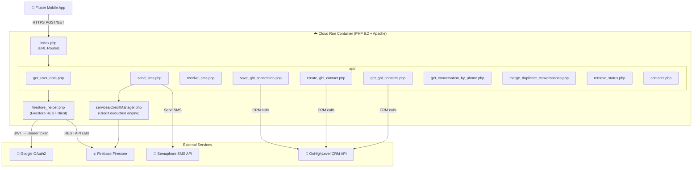

# NOLA SMS Pro — Backend Overview

> **Stack:** PHP 8.2 · Apache · Google Cloud Run · Firebase Firestore · Semaphore SMS · GoHighLevel (GHL) API

---

## 🏗️ Architecture at a Glance



---

## 📁 Directory Structure

```
nola-backend-cloud/
├── index.php                    # URL router — maps /api/* to files
├── Dockerfile                   # PHP 8.2 + Apache, exposes port 8080
├── .htaccess                    # Apache rewrite rules
├── .env                         # Environment config (keys/URLs)
├── api/
│   ├── config.php               # Loads env vars (API keys, URLs)
│   ├── firestore_helper.php     # All Firestore REST operations
│   ├── get_user_data.php        # Fetch user's GHL connection state
│   ├── send_sms.php             # Core: send SMS + log conversation
│   ├── receive_sms.php          # Webhook: inbound SMS from Semaphore
│   ├── save_ghl_connection.php  # Save GHL location_id/token to Firestore
│   ├── create_ghl_contact.php   # Create a contact in GHL CRM
│   ├── get_ghl_contacts.php     # Fetch contacts from GHL
│   ├── get_conversation_by_phone.php
│   ├── merge_duplicate_conversations.php
│   ├── retrieve_status.php      # Check SMS delivery status
│   └── contacts.php
├── services/
│   └── CreditManager.php        # Credit calculation & Firestore deduction
├── secure/
│   └── firebase_service_account.json  # 🔑 Google Service Account (OAuth)
├── oauth_callback.php           # GHL OAuth callback handler
└── composer.json                # PHP dependencies (google/cloud-firestore)
```

---

## 🌐 API Endpoints

All endpoints are under `POST /api/<filename>.php` unless noted.

| Endpoint | Method | Purpose |
|---|---|---|
| `/api/get_user_data.php` | POST | Fetch user's `locationId`, `senderId`, `connected` status from Firestore |
| `/api/send_sms.php` | POST | Send SMS via Semaphore; create/update conversation + message docs in Firestore; deduct credits |
| `/api/receive_sms.php` | POST | Webhook receiver for inbound SMS from Semaphore → writes to Firebase RTDB |
| `/api/save_ghl_connection.php` | POST | Saves GHL `location_id`, `ghl_token`, `sender_id` to user's Firestore doc |
| `/api/create_ghl_contact.php` | POST | Creates a new contact in GHL CRM using stored GHL token |
| `/api/get_ghl_contacts.php` | POST | Lists contacts from GHL CRM for the user's location |
| `/api/get_conversation_by_phone.php` | POST | Looks up a Firestore conversation thread by phone number |
| `/api/merge_duplicate_conversations.php` | POST | Merges duplicate conversation docs in Firestore |
| `/api/retrieve_status.php` | POST | Retrieves SMS delivery status from Semaphore |
| `/api/contacts.php` | POST | Local contact management |

---

## 🔥 Firestore Data Model

The backend reads/writes these Firestore collections:

| Collection | Document ID | Key Fields |
|---|---|---|
| `users` | `{firebase_uid}` | `locationId`, `senderId`, `ghlToken`, `connected` |
| `conversations` | `{locationId}_{contactId}` or `local_{phone}` | `owner_uid`, `number`, `last_message`, `last_at`, `status`, `active`, `is_bulk` |
| `messages` | `msg_{random}_{timestamp}` | `conversation_id`, `direction`, `message`, `status`, `created_at_ms`, `request_id` |
| `agency_subaccounts` | `{locationId}` | `agency_id` |
| `integrations` | `ghl_{locationId}` | `credit_balance` |
| `credit_transactions` | *(auto-generated)* | `amount`, `balance_after`, `provider_cost`, `charged`, `profit` |
| `admin_config` | `global_pricing` | `provider_cost`, `charged` |

---

## 📡 SMS Send Flow (send_sms.php)

```
App → POST /api/send_sms.php
  1. Validate input (number, message, ownerUid)
  2. Check for duplicate request (via request_id)
  3. Find or create a conversation thread in Firestore
  4. Write message doc with status="Pending"
  5. Call Semaphore SMS API
  6. On success → deduct credits via CreditManager
       - Checks subaccount credit_balance in Firestore
       - Atomic transaction: deduct + write credit_transactions log
       - Fails message if insufficient credits (HTTP 402)
  7. Update message doc: status="Sent" | "Failed"
  8. Update conversation doc: last_message, last_at, status
  9. Return JSON response to app
```

---

## 💳 Credit System (CreditManager.php)

- Credits are stored per **GHL location** (`integrations/ghl_{locationId}.credit_balance`)
- **Segment calculation** follows GSM-7 standard:
  - Single SMS: up to 160 chars (GSM-7) or 70 chars (Unicode)
  - Multi-part: 153 chars/segment (GSM-7) or 67 chars/segment (Unicode)
  - Total credits = `segments × num_recipients`
- Pricing is configurable via `admin_config/global_pricing` (default: ₱0.02 provider cost, ₱0.05 charged)
- All deductions are atomic Firestore transactions — prevents double-spend

---

## 🔐 Authentication & Security

| Mechanism | Where Used |
|---|---|
| **Firebase Service Account JWT** | All Firestore REST calls — self-signed RS256 JWT exchanged for a Google Bearer token |
| **GHL OAuth token** | Stored per user in Firestore; sent as `Authorization: Bearer` to GHL API |
| **Firebase UID** | Used as the user identity in all API calls (passed from the Flutter app) |
| **CORS headers** | Set on all endpoints (`Access-Control-Allow-Origin: *`) |

> [!WARNING]
> The service account JSON is stored in `secure/firebase_service_account.json` inside the container. For production hardening, this should be injected as an environment variable (`FIREBASE_SERVICE_ACCOUNT_JSON`) instead — the code already supports this fallback in `firestore_helper.php`.

---

## ☁️ Deployment

- **Runtime:** Docker container (PHP 8.2 + Apache)
- **Platform:** Google Cloud Run (auto-scales, port 8080)
- **Build:** `docker build` → push to Google Container Registry → deploy via `gcloud run deploy`
- **URL routing:** `index.php` acts as the router — requests to `/api/*.php` are `require`-included directly

---

## 🔗 External Integrations

| Service | Purpose |
|---|---|
| **Semaphore** (`api.semaphore.co`) | Philippine SMS gateway for sending/receiving SMS |
| **GoHighLevel** (`services.leadconnectorhq.com`) | CRM — contact management, conversation sync |
| **Firebase Firestore** | Primary database for users, conversations, messages, credits |
| **Google OAuth2** | Service account auth for Firestore REST API access |
