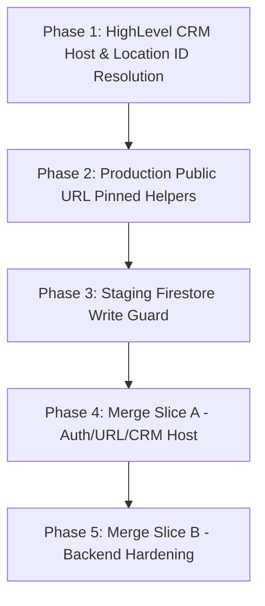

# Code changes audit and review
_Exported on 9/9/2026 at 14:04:22 GMT+8 from Cursor (3.19.13)_

---

**User**

Re-analyze and Re-verify the changes made yesterday and the implementation plan i want to addressed especially the monorepo that accidentally created even thoug we have frontend repo, the frequent 500 internal error for the subaccount FunnelSuite encountered and incomming messages for other registered sender ids that could potentially also experience this one(but i have fixed this before i dont know why it turns back. I think its connected with the api key migration i did yesterday, and the Sender Request Page Black/Black Bug or Error please analyze everything and then revise and improve the audit if needed:

# Detailed Audit: Recent Code Changes & Implementation Plan Roadmap

**Audit Date:** September 9, 2026  
**Workspace:** `NOLA SMS PRO` (Branch: `staging`)  
**Scope:** Review of all code changes executed yesterday (September 8, 2026), current working tree delta, and remaining roadmap items to solve in the implementation plan.

---

## Executive Summary of Completed Work (Yesterday: Sept 8, 2026)

Yesterday's engineering efforts focused on two major areas:
1. **Semaphore Global API Key Subaccount Migration & Billing Patch:** Migrating client subaccounts from individual custom API keys to the unified Global/Boss Semaphore API key while updating billing logic to ensure system/user credit deductions function properly.
2. **Admin Portal Stability & Provider Balance Sync:** Resolving front-end crashes on the Admin Portal's `SenderRequests` page and fixing cache-override write-backs for provider account balance tracking.

---

## Highlighted Code Changes (Yesterday & Current Delta)

### 1. Semaphore Global API Key & Billing Patch
**Commit:** `3ca6060` — *feat: migrate subaccounts to Semaphore Global API Key and patch billing logic*

#### [MODIFY] [config.php](file:///c:/Users/Welcome/NOLA%20SMS%20PRO/api/webhook/config.php#L6)
- **Change:** Exposed `SEMAPHORE_GLOBAL_API_KEY` from environment configuration.
- **Diff:**
```diff
 return [
     'SEMAPHORE_API_KEY' => getenv('SEMAPHORE_API_KEY') ?: '',
+    'SEMAPHORE_GLOBAL_API_KEY' => getenv('SEMAPHORE_GLOBAL_API_KEY') ?: '',
     'SEMAPHORE_URL' => getenv('SEMAPHORE_URL') ?: 'https://api.semaphore.co/api/v4/messages',
```

#### [MODIFY] [SenderResolver.php](file:///c:/Users/Welcome/NOLA%20SMS%20PRO/api/services/SenderResolver.php#L40-L90)
- **Change:** Updated custom key classification logic. If a subaccount's custom key matches `SEMAPHORE_GLOBAL_API_KEY`, it sets `$usingCustomKey = false`. This ensures subaccounts migrated to the global key are billed against system/user credits rather than being flagged for external custom key usage.
- **Diff:**
```diff
             if (!empty($intData['nola_pro_api_key'])) {
                 $activeApiKey = $intData['nola_pro_api_key'];
                 $apiKeySource = 'integration.nola_pro_api_key';
-                $usingCustomKey = true;
+                
+                if ($globalSemaphoreKey !== '' && $semaphoreCustomKey === $globalSemaphoreKey) {
+                    $usingCustomKey = false;
+                } else {
+                    $usingCustomKey = true;
+                }
```

#### [NEW] [migrate_api_keys.php](file:///c:/Users/Welcome/NOLA%20SMS%20PRO/scripts/migrate_api_keys.php)
- **Purpose:** CLI script to bulk-migrate Firestore `integrations` records to the Global Semaphore API Key (`SEMAPHORE_GLOBAL_API_KEY`).
- **Key Logic:**
  - Iterates over all documents in Firestore `integrations` collection.
  - Updates `nola_pro_api_key` and `semaphore_api_key` to the global key.
  - Sets `provider_preference = 'semaphore_custom'`.
  - Excludes `jnkrental` and accounts using `unisms`.
  - Includes `--dry-run` and `--apply` flags.

#### [NEW] [backfill_sender_requests.php](file:///c:/Users/Welcome/NOLA%20SMS%20PRO/scripts/backfill_sender_requests.php)
- **Purpose:** CLI script to backfill `sender_id_requests` collection for pre-existing integrations with approved sender IDs.
- **Key Logic:**
  - Scans `integrations` collection for non-empty `approved_sender_id`.
  - Generates request document with ID `{locationId}_{md5(senderId)}`.
  - Sets `status = 'approved'`, `provider = 'semaphore'`, and timestamps.

---

### 2. Admin Portal Crash Fix & Provider Balances Cache Override
**Commit:** `8cef65e` — *fix: Admin SenderRequests crash and Provider balances cache override*

#### [MODIFY] [SenderRequests.tsx](file:///c:/Users/Welcome/NOLA%20SMS%20PRO/admin/src/pages/components/SenderRequests.tsx#L42-L666)
- **Change:** Fixed front-end crash where `req.requested_id` was `undefined` or `null`. Wrapped string operations with `String(req.requested_id || '')` and rendered `'Unknown'` fallback. Added character count pill for requested sender names.
- **Diff:**
```diff
- const normalized = value.trim().toLowerCase();
+ const normalized = String(value || '').trim().toLowerCase();

- {req.requested_id.substring(0, 2).toUpperCase()}
+ {String(req.requested_id || '').substring(0, 2).toUpperCase()}

- <span className="font-black text-[15px]...">{req.requested_id}</span>
+ <span className="font-black text-[15px]...">{req.requested_id || 'Unknown'}</span>
+ <span className="px-2.5 py-1 ...">{String(req.requested_id || '').length} chars</span>
```

#### [MODIFY] [admin_provider_balances.php](file:///c:/Users/Welcome/NOLA%20SMS%20PRO/api/admin/admin_provider_balances.php#L67-L83)
- **Change:** Forced explicit live balance summary fetch when `$bypassCache` is passed (`?refresh=1`), and immediately persisted the fresh summary to Firestore (`admin_config/provider_balance_summary`).
- **Diff:**
```diff
 $summary = $bypassCache
-    ? $fetcher->getSystemProviderSummary()
+    ? $fetcher->getDashboardSummary($db)
     : $fetcher->getLightweightDashboardSummary($db, true);

+if ($bypassCache) {
+    try {
+        $db->collection('admin_config')->document('provider_balance_summary')->set([
+            'summary' => $summary,
+            'updated_at' => (new \DateTimeImmutable())->format(\DateTimeInterface::ATOM)
+        ], ['merge' => true]);
+    } catch (\Throwable $e) { ... }
+}
```

---

### 3. Uncommitted Working Tree Enhancements (Today: Sept 9, 2026)

#### [MODIFY] [SemaphoreProvider.php](file:///c:/Users/Welcome/NOLA%20SMS%20PRO/api/services/providers/SemaphoreProvider.php#L326)
- **Change:** Expanded error mapping to treat 5xx HTTP response codes (500–599) and 408 timeouts as `SemaphoreTimeoutException`. This guarantees temporary provider outages are gracefully caught by retry mechanisms.

#### [NEW] [verify_migration.php](file:///c:/Users/Welcome/NOLA%20SMS%20PRO/scripts/verify_migration.php)
- **Purpose:** Diagnostic tool to verify that all subaccounts with approved sender IDs in Firestore match the expected Global/Boss Semaphore API key.

---

## User Review Required

> [!IMPORTANT]
> **Staging CRM Host & Location ID Resolution**: Installs must direct users back to their exact HighLevel subaccount on the correct CRM host (`app.nolacrm.io` vs `app.gohighlevel.com` / LeadConnector). We need to confirm whether any white-label agency domains outside `nolacrm.io` and `gohighlevel.com` should be explicitly added to the allowlist.

> [!WARNING]
> **Staging Write Guard (`STAGING_ALLOWED_LOCATION_IDS`)**: Staging shares backend resources with production. A whitelist of test location IDs (`STAGING_ALLOWED_LOCATION_IDS`) will be enforced on `sms-api-staging` so QA tests cannot overwrite paying subaccount `ghl_tokens`.

---

## Open Questions

> [!IMPORTANT]
> 1. **UniSMS HTTP 422 Hyperlink Policy**: UniSMS rejects SMS containing links when compliance settings prohibit them. Should outbound messages with URLs targeting UniSMS accounts fail immediately (pre-billing 422 block) or auto-fallback to Semaphore? *(Recommended: Immediate 422 pre-billing block to prevent credit deduction).*
> 2. **Legacy Cloud Scheduler Cleanup**: Should we proceed with running `gcloud scheduler jobs delete firebase-schedule-keepWarm-asia-southeast1` to eliminate the recurring 4-minute 404 logs?

---

## Proposed Changes: Implementation Plan Roadmap



### Phase 1 — HighLevel CRM Host & Location ID Deep Link Resolution
#### [MODIFY] [install_helpers.php](file:///c:/Users/Welcome/NOLA%20SMS%20PRO/api/install_helpers.php)
- Update `install_detect_crm_base_url()` to detect domain in strict priority order:
  1. `state.crm_domain` if allowlisted.
  2. `Referer` / `Origin` header.
  3. GHL `/locations/{locationId}` API payload.
  4. Stored `ghl_tokens/{locationId}.crm_domain`.
  5. Default: `https://app.gohighlevel.com` (for marketplace installs) instead of `app.nolacrm.io`.

#### [MODIFY] [ghl_callback.php](file:///c:/Users/Welcome/NOLA%20SMS%20PRO/pages/ghl_callback.php)
- Pass resolved `crm_domain` into redirect parameters and persist to `ghl_tokens/{locationId}.crm_domain`.

#### [MODIFY] [install-login.php](file:///c:/Users/Welcome/NOLA%20SMS%20PRO/pages/install-login.php) & [install-register.php](file:///c:/Users/Welcome/NOLA%20SMS%20PRO/pages/install-register.php)
- Deep link to `/v2/location/{location_id}/custom-page-link/{pageId}` using strictly the **resolved install location ID**.
- Remove `GHL_MARKETPLACE_LOC_ID` fallback to prevent hardcoding NOLA HQ location (`ugBqfQsPtGijLjrmLdmA`).

---

### Phase 2 — Production-Safe Public URL Helpers
#### [MODIFY] [request_context.php](file:///c:/Users/Welcome/NOLA%20SMS%20PRO/api/request_context.php)
- Pin production OAuth callback `https://smspro-api.nolacrm.io/oauth/callback` strictly when `K_SERVICE = 'sms-api'`.
- Retain dynamic host-based resolution on `sms-api-staging`.

---

### Phase 3 — Staging Write Guard
#### [MODIFY] [firestore_client.php](file:///c:/Users/Welcome/NOLA%20SMS%20PRO/api/webhook/firestore_client.php) or [install_helpers.php](file:///c:/Users/Welcome/NOLA%20SMS%20PRO/api/install_helpers.php)
- Add env check `STAGING_ALLOWED_LOCATION_IDS`. On staging (`APP_ENV=staging`), reject token persistence if `locationId` is not in the whitelist.

---

### Phase 4 — System Hardening & Operational Cleanups
#### Operational Commands
- Delete orphaned keep-warm job:
  `gcloud scheduler jobs delete firebase-schedule-keepWarm-asia-southeast1 --location=asia-southeast1`
- Add CORS header `Authorization` in [`frontend/agency/nginx.conf`](file:///c:/Users/Welcome/NOLA%20SMS%20PRO/frontend/agency/nginx.conf#L26).

---

## Verification Plan

### Automated Tests
- Run migration verification: `php scripts/verify_migration.php`
- Run dry-run backfill check: `php scripts/backfill_sender_requests.php --dry-run`
- Execute unit test suite: `php vendor/bin/phpunit` (or Laravel test suite)

### Manual Verification
1. **Admin Portal**: Verify `/sender-requests` page renders cleanly without UI crashes for missing sender IDs.
2. **Provider Balances**: Click refresh icon on `/provider-balances` and verify updated balance timestamp in Firestore (`admin_config/provider_balance_summary`).
3. **OAuth Install Flow**: Complete install test on staging and confirm custom-page deep link targets the specific subaccount location ID on `app.gohighlevel.com` or `app.nolacrm.io`.


---

**Cursor**

I'll re-analyze yesterday's changes against the live code, logs, and the implementation plan—especially the accidental monorepo, FunnelSuite 500s, inbound sender-ID routing, and the Sender Requests black-on-black bug—then revise the audit with verified findings.

I'll pull yesterday's commits, the frontend/monorepo layout, inbound routing, and the Sender Requests / FunnelSuite paths so the audit matches what's actually in the tree.

I've confirmed the causal chain: the nested frontend clone, inbound routing after the global-key migration, and Sender Requests docs missing `requested_id`. I'll revise the audit so those P0 items sit in front of the CRM/staging roadmap.

The original audit was **accurate on the two Sept 8 commits**, and **too narrow**. The CRM/staging plan is still valid, but it is **not** what is breaking FunnelSuite, inbound replies, or Sender Requests. Those come from the **global API-key cutover** plus a nested frontend copy this repo should not own.

I rewrote `docs/AUDIT_AND_IMPLEMENTATION_PLAN_2026-09-09.md` so P0 work sits **before** CRM-host / staging merge slices.

**Yesterday’s commits (verified)**  
- `3ca6060` — expose `SEMAPHORE_GLOBAL_API_KEY`, treat matching keys as **not** custom for billing, plus migrate/backfill scripts.  
- `8cef65e` — stop Sender Requests from crashing on null `requested_id`; persist provider-balance refresh to Firestore.

That billing flag is working as designed. Migrated accounts (FunnelSuite included) now **spend NOLA credits**. Zero balance is **402**, not 500. The 500s and missing inbound are a different failure class.

**Accidental “monorepo”**  
This backend already tracks `admin/`, `user/`, and `agency/`. Untracked `frontend/` is a **full nested git clone** of `nola-sms-pro-frontend` (own `.git`, `staging` **ahead 6**). Cloud Build already ignores `frontend/`. Do **not** commit it. Preserve those 6 commits on the real frontend remote, delete the nested folder, and add `/frontend/` to `.gitignore`. Edits in the wrong tree are why Admin fixes look like they “didn’t stick.”

**FunnelSuite 500s and inbound for other sender IDs**  
The migration put everyone on the **boss** Semaphore account, so outbound **and** inbound share one webhook: `/webhook/receive_sms`. That handler still routes only by **replying phone → newest conversation**. It does not use destination sender ID, does not normalize `639` vs `09`, and has **no try/catch** around the Firestore query — an exception is a **500**, Semaphore retries, and it looks “frequent.” A previous inbound fix can look reverted because the **webhook account** changed, not because the old phone matcher was deleted.

So FunnelSuite is not special: **any** migrated alphanumeric sender can drop replies, attach them to the wrong location, or 500 the webhook. Outbound 500s are more likely **sender not registered on the boss account** or an uncaught provider error (mapped as 500), not the billing patch itself.

**Sender Requests black/black**  
`8cef65e` only stopped the crash. `backfill_sender_requests.php` writes `sender_id` and **never** `requested_id`. The admin list API returns raw docs. The UI still reads `requested_id` → **Unknown**, empty avatar, dark row on dark page. Approve paths that write `requested_id` can persist **null**. That is the migration + UI together, not a leftover `substring` crash (unless production Admin was never redeployed).

**CRM/staging plan** — still not implemented: CRM default is still `app.nolacrm.io`, `GHL_MARKETPLACE_LOC_ID` is still hardcoded in `install-register.php`, OAuth is not pinned by `K_SERVICE`, and `STAGING_ALLOWED_LOCATION_IDS` does not exist. Agency CORS `Authorization` is **already** in nginx; that checklist item is done.

**Do not run** `scripts/verify_migration.php` until the hardcoded boss key is removed (use env only; rotate if that file was shared).

Highest-priority order in the revised doc: nested frontend → inbound sender-ID routing + FunnelSuite error mapping → Sender Request schema/API/UI + Admin deploy → then Phases 1–5 of the install/CRM plan.

---

**User**

May we fix all of them safely without producing any errors and perform best you can do to address all ot this issues please?

---

**Cursor**

I'll fix the P0 issues first (inbound routing, Sender Requests schema/UI, nested-repo gitignore, safe error mapping), then apply the CRM/staging guards carefully so we don't break production.

---

**User**

continue please

---

**Cursor**

I'll continue from the remaining P0 and P1 work: inbound routing, Sender Requests data/UI, then the CRM/staging guards.

Implementing the core code changes now: inbound routing, Sender Requests, gitignore, and the CRM/staging guards.

---

**User**

continue

