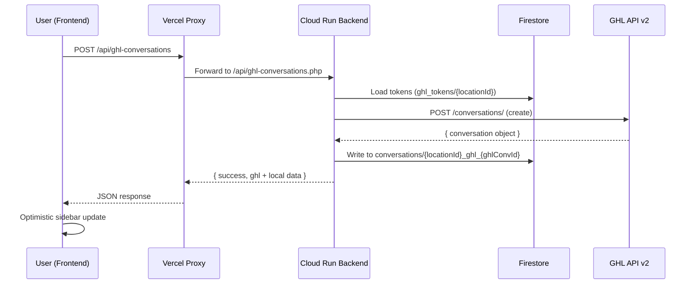

# GHL "Create Conversation" Integration — Improved Plan

This plan integrates the GHL Create Conversation API so that SMS Pro can create conversations on the GHL Dashboard programmatically, keep them in sync with the local Firestore sidebar, and expose this as both a UI action (frontend) and a GHL Marketplace workflow action.

## User Review Required

> [!IMPORTANT]
> **Zero-Downtime "Shadow Integration"**: Phase 1 extracts the existing token/retry logic from [ghl_contacts.php](file:///c:/Users/User/nola-sms-pro/NOLA-SMS-Pro-Backend/api/ghl_contacts.php) into a reusable `GhlClient.php`. We validate it by shadow-refactoring one existing endpoint (contact fetch) before using it for the new conversation feature.

> [!WARNING]
> **OAuth Scope**: The existing install URL in [ghl_callback.php](file:///c:/Users/User/nola-sms-pro/NOLA-SMS-Pro-Backend/ghl_callback.php#L447) already includes `conversations.write`, `conversations.readonly`, and `conversations/message.write`. **No marketplace scope changes are needed.** Existing installations must re-authorize only if future scopes are added.

> [!CAUTION]
> **Open Questions:**
> 1. **Where should the "Sync to GHL" button live?** Options: (A) Inside the chat header area of [Composer.tsx](file:///c:/Users/User/nola-sms-pro/src/components/Composer.tsx), (B) on the [Sidebar.tsx](file:///c:/Users/User/nola-sms-pro/src/components/Sidebar.tsx) conversation item context menu, or (C) both. What's preferred?
> 2. **Should conversation creation happen automatically on first SMS send** (no user click needed), or **only via manual button click**?
> 3. **For the GHL Marketplace custom action**: Do you want it registered as a Workflow Action (triggers from GHL automations like "Tag Added → Create Conversation") now, or is that a future phase?

---

## Architecture Overview



---

## Proposed Changes

### Phase 1: Foundation — Backend Service Extraction

#### [NEW] [GhlClient.php](file:///c:/Users/User/nola-sms-pro/NOLA-SMS-Pro-Backend/api/services/GhlClient.php)

Reusable class extracted from the existing procedural code in [ghl_contacts.php](file:///c:/Users/User/nola-sms-pro/NOLA-SMS-Pro-Backend/api/ghl_contacts.php):

| Method | Source | Purpose |
|---|---|---|
| `__construct($db, $locationId)` | Lines 13–55 of [ghl_contacts.php](file:///c:/Users/User/nola-sms-pro/NOLA-SMS-Pro-Backend/api/ghl_contacts.php) | Load integration from Firestore |
| `refreshToken()` | [refreshGHLToken()](file:///c:/Users/User/nola-sms-pro/NOLA-SMS-Pro-Backend/api/ghl_contacts.php#57-129) L60–128 | Proactive + 401-retry refresh |
| [request($method, $path, $body, $headers)](file:///c:/Users/User/nola-sms-pro/NOLA-SMS-Pro-Backend/api/auth_helpers.php#3-20) | [executeGHLRequest()](file:///c:/Users/User/nola-sms-pro/NOLA-SMS-Pro-Backend/api/ghl_contacts.php#174-224) L177–222 | Generic HTTP with auto-retry |
| `getContacts()` | L246–278 | Convenience wrapper |
| `createConversation($contactId, $name)` | **New** | `POST /conversations/` |

Key behaviors:
- **Proactive token refresh** if `expires_at - now < 300s` (existing logic from L145–163)
- **Retry once on 401** (existing logic from L202–218)
- **API Version header**: `Version: 2021-04-15` for conversations endpoint (different from contacts `2021-07-28`)
- **Location-scoped**: constructor requires `locationId`, no single-tenant fallback

---

### Phase 1.5: Shadow Validation

#### [MODIFY] [ghl_contacts.php](file:///c:/Users/User/nola-sms-pro/NOLA-SMS-Pro-Backend/api/ghl_contacts.php)

Refactor the GET (fetch contacts) handler at L246–278 to use `GhlClient`:

```diff
-$url = "{$GHL_API_URL}/contacts?locationId={$GHL_LOCATION_ID}&limit=100";
-$headers = [...];
-$resp = executeGHLRequest($url, 'GET', $headers, null, $db, $integration);
+$client = new GhlClient($db, $locationHeader);
+$resp = $client->request('GET', '/contacts', null, ['locationId' => $GHL_LOCATION_ID, 'limit' => 100]);
```

The old procedural functions ([getGHLIntegration](file:///c:/Users/User/nola-sms-pro/NOLA-SMS-Pro-Backend/api/ghl_contacts.php#17-56), [refreshGHLToken](file:///c:/Users/User/nola-sms-pro/NOLA-SMS-Pro-Backend/api/ghl_contacts.php#57-129), [executeGHLRequest](file:///c:/Users/User/nola-sms-pro/NOLA-SMS-Pro-Backend/api/ghl_contacts.php#174-224)) stay in the file for now — POST/PUT/DELETE handlers continue using them. This limits blast radius.

---

### Phase 2: Backend — New Endpoint

#### [NEW] [ghl-conversations.php](file:///c:/Users/User/nola-sms-pro/NOLA-SMS-Pro-Backend/api/ghl-conversations.php)

Dedicated endpoint for GHL conversation operations.

**POST — Create GHL Conversation**

| Field | Type | Required | Notes |
|---|---|---|---|
| `contactId` | string | ✅ | GHL contact ID |
| `locationId` | string | ✅ (from header) | Via `X-GHL-Location-ID` |
| [name](file:///c:/Users/User/nola-sms-pro/src/api/sms.ts#598-629) | string | ❌ | Custom conversation name |

**Request flow:**
1. Validate `contactId` present in body
2. Instantiate `GhlClient($db, $locationId)`
3. Call GHL `POST /conversations/` with payload:
   ```json
   {
     "locationId": "{{locationId}}",
     "contactId": "{{contactId}}"
   }
   ```
4. On success → write to Firestore `conversations` collection (see Phase 3)
5. Return combined response: `{ success: true, ghl: {...}, local: {...} }`

**Error handling:**
- Missing `contactId` → 400
- GHL API error → forward status + `{ error, ghl_status, ghl_error }`
- Firestore write failure → 207 (partial success — GHL succeeded, local failed)

#### [MODIFY] [.htaccess](file:///c:/Users/User/nola-sms-pro/NOLA-SMS-Pro-Backend/.htaccess)

Add routing rule after the `ghl-contacts` rule (L58):

```diff
 RewriteRule ^api/ghl-contacts$ /api/ghl-contacts.php [L,QSA]
+RewriteRule ^api/ghl-conversations$ /api/ghl-conversations.php [L,QSA]
```

---

### Phase 3: Local State Sync

#### [MODIFY] [conversations.php](file:///c:/Users/User/nola-sms-pro/NOLA-SMS-Pro-Backend/api/conversations.php)

No changes to this file. The Firestore write happens inside `ghl-conversations.php` directly using the established pattern:

```php
$db->collection('conversations')->document($docId)->set([
    'id'              => $docId,
    'location_id'     => $locationId,
    'type'            => 'direct',
    'name'            => $contactName ?: 'GHL Contact',
    'ghl_conversation_id' => $ghlConversationId,
    'ghl_contact_id'  => $contactId,
    'members'         => [$phone],
    'last_message'    => null,
    'last_message_at' => new Timestamp($now),
    'updated_at'      => new Timestamp($now),
    'source'          => 'ghl_sync',
], ['merge' => true]);
```

The `docId` format follows the existing pattern: `{locationId}_conv_{phone}` — so the sidebar picks it up automatically.

---

### Phase 4: Frontend — Proxy + API + UI

#### [NEW] [ghl-conversations.ts](file:///c:/Users/User/nola-sms-pro/api/ghl-conversations.ts)

Vercel serverless proxy (same pattern as [ghl-contacts.ts](file:///c:/Users/User/nola-sms-pro/api/ghl-contacts.ts)):

```typescript
// Proxy POST /api/ghl-conversations → Cloud Run /api/ghl-conversations
```

#### [MODIFY] [config.ts](file:///c:/Users/User/nola-sms-pro/src/config.ts)

Add new endpoint to `API_CONFIG`:

```diff
 ghl_contacts: `${API_BASE}/api/ghl-contacts`,
+ghl_conversations: `${API_BASE}/api/ghl-conversations`,
```

#### [NEW] [src/api/ghlConversations.ts](file:///c:/Users/User/nola-sms-pro/src/api/ghlConversations.ts)

Frontend API client:

```typescript
export const createGhlConversation = async (
  contactId: string,
  contactName?: string
): Promise<{ success: boolean; ghl?: any; local?: any; error?: string }>
```

Follows the same pattern as [sendSms()](file:///c:/Users/User/nola-sms-pro/src/api/sms.ts#127-211) in [sms.ts](file:///c:/Users/User/nola-sms-pro/src/api/sms.ts#L127-L210):
- Reads `ghlLocationId` from `getAccountSettings()`
- Sets `X-GHL-Location-ID` header
- Posts to `API_CONFIG.ghl_conversations`

#### [MODIFY] Frontend Component (UI Button)

> Pending decision on question #1 above (Composer vs Sidebar vs both)

The button implementation will:
1. Show a "Sync to GHL" or "Create in GHL" button with a GHL icon
2. Call `createGhlConversation(contact.id, contact.name)`
3. Show optimistic loading state → success toast → update sidebar
4. Disable button if conversation already has `ghl_conversation_id`
5. Error state shows inline error message

---

### Phase 5: GHL Marketplace (Future/Optional)

#### [MODIFY] GHL App Manifest — Workflow Action Registration

> [!NOTE]
> This phase is optional and depends on your answer to question #3 above. It requires:
> 1. Registering a **Custom Action** in the GHL Marketplace developer portal
> 2. Creating a webhook endpoint that GHL calls when the workflow triggers
> 3. The endpoint receives `contactId` + `locationId` from GHL and calls `GhlClient->createConversation()`

**If pursued, the new endpoint would be:**

#### [NEW] [webhook/ghl_create_conversation.php](file:///c:/Users/User/nola-sms-pro/NOLA-SMS-Pro-Backend/api/webhook/ghl_create_conversation.php)

Webhook handler for GHL Workflow Actions:
- Validates the webhook signature
- Extracts `contactId` and `locationId` from the GHL payload
- Uses `GhlClient` to create the conversation
- Returns 200 to acknowledge

---

## Safety & Rollback Strategy

| Risk | Mitigation |
|---|---|
| `GhlClient.php` breaks contacts | Shadow test: only GET handler refactored first, POST/PUT/DELETE untouched |
| GHL API changes | `Version: 2021-04-15` header pins to stable API version |
| Token refresh loop | [request()](file:///c:/Users/User/nola-sms-pro/NOLA-SMS-Pro-Backend/api/auth_helpers.php#3-20) retries max once on 401, then throws |
| New endpoint failure | New files only — rollback = delete `GhlClient.php` + `ghl-conversations.php` + `ghl-conversations.ts` |
| Firestore sync failure | 207 partial response — GHL conversation still created, logged for manual fix |

---

## File Change Summary

| Layer | File | Action | Description |
|---|---|---|---|
| Backend | `api/services/GhlClient.php` | **NEW** | Reusable GHL API client class |
| Backend | `api/ghl-conversations.php` | **NEW** | Create conversation endpoint |
| Backend | [api/ghl_contacts.php](file:///c:/Users/User/nola-sms-pro/NOLA-SMS-Pro-Backend/api/ghl_contacts.php) | **MODIFY** | Shadow-refactor GET to use `GhlClient` |
| Backend | [.htaccess](file:///c:/Users/User/nola-sms-pro/NOLA-SMS-Pro-Backend/.htaccess) | **MODIFY** | Add route for `ghl-conversations` |
| Frontend | `api/ghl-conversations.ts` | **NEW** | Vercel proxy function |
| Frontend | [src/config.ts](file:///c:/Users/User/nola-sms-pro/src/config.ts) | **MODIFY** | Add `ghl_conversations` to `API_CONFIG` |
| Frontend | `src/api/ghlConversations.ts` | **NEW** | API client function |
| Frontend | Component TBD | **MODIFY** | "Sync to GHL" button |
| Marketplace | `api/webhook/ghl_create_conversation.php` | **NEW** (optional) | Workflow action webhook |

---

## Verification Plan

### Manual Verification (Primary)

Since this project has no automated test framework, verification is manual:

1. **Backend Shadow Test (Phase 1.5)**
   - After deploying `GhlClient.php` + modified [ghl_contacts.php](file:///c:/Users/User/nola-sms-pro/NOLA-SMS-Pro-Backend/api/ghl_contacts.php):
   - Open SMS Pro inside GHL → go to Contacts tab
   - Verify contacts still load correctly (no 401s, no missing contacts)
   - Check Cloud Run logs for any `GhlClient` errors

2. **Create Conversation Test (Phase 2)**
   - Use curl or Postman against the Cloud Run backend:
     ```bash
     curl -X POST https://smspro-api.nolacrm.io/api/ghl-conversations \
       -H "Content-Type: application/json" \
       -H "X-Webhook-Secret: f7RkQ2pL9zV3tX8cB1nS4yW6" \
       -H "X-GHL-Location-ID: YOUR_LOCATION_ID" \
       -d '{"contactId": "VALID_GHL_CONTACT_ID"}'
     ```
   - Expected: 200 with `{ success: true, ghl: { id: "..." }, local: { id: "..." } }`
   - Verify in GHL Dashboard → Conversations tab → new conversation appears
   - Verify in Firestore → `conversations` collection → new doc exists

3. **Frontend Integration Test (Phase 4)**
   - Open SMS Pro in GHL
   - Click on a contact with a known GHL Contact ID
   - Click "Sync to GHL" button
   - Verify: button shows loading → success → conversation appears in sidebar
   - Verify: conversation appears in GHL Dashboard
   - Test error case: disconnect API → click button → verify error message shown

4. **Edge Cases to Test Manually**
   - Create conversation for contact that already has one → should return existing (idempotent on GHL side)
   - Create conversation with expired token → should auto-refresh and succeed
   - Create conversation with invalid `contactId` → should return 400/422 error

> [!TIP]
> If you'd like, I can also write a simple PHP test script (`test_ghl_client.php`) that validates the `GhlClient` token refresh and request flow without needing the full app running.

# Backend Handoff — GHL "Create Conversation" Integration

*Date*: March 26, 2026  
*Priority*: High  
*Frontend Status*: Ready (pending backend deployment)

---

## Objective

Create a backend endpoint that creates a conversation on the GHL Dashboard via their API, and syncs it into the local Firestore conversations collection so it immediately appears in the SMS Pro sidebar.

---

## What the Frontend Expects

### Endpoint

POST /api/ghl-conversations

### Request Headers

| Header | Value | Source |
|---|---|---|
| Content-Type | application/json | Frontend sets this |
| X-Webhook-Secret | f7RkQ2pL9zV3tX8cB1nS4yW6 | Vercel proxy adds this |
| X-GHL-Location-ID | {locationId} | Frontend passes from getAccountSettings().ghlLocationId |

### Request Body

{
  "contactId": "abc123xyz",
  "contactName": "Francis Cortez"
}

| Field | Type | Required | Notes |
|---|---|---|---|
| contactId | string | ✅ | GHL Contact ID (from ghl_contacts.php response) |
| contactName | string | ❌ | Display name for local conversation doc |

### Expected Success Response (200)

{
  "success": true,
  "ghl_conversation_id": "conv_abc123",
  "local_conversation_id": "LOCATION_ID_conv_09171234567",
  "message": "Conversation created"
}

### Expected Error Responses

| Status | When | Body |
|---|---|---|
| 400 | Missing contactId | { "success": false, "error": "contactId is required" } |
| 401 | Invalid webhook secret | { "status": "error", "message": "Unauthorized Access" } |
| 404 | GHL integration not found | { "success": false, "error": "GHL integration not found" } |
| 422 | GHL API rejected request | { "success": false, "error": "GHL API error", "ghl_status": 422, "ghl_error": "..." } |
| 500 | Server error | { "success": false, "error": "...", "message": "..." } |

---

## Implementation Guide

### Phase 1: New Service Class — GhlClient.php

*File*: api/services/GhlClient.php  
*Purpose*: Extract the reusable GHL API logic that's currently duplicated in ghl_contacts.php.

The following functions from ghl_contacts.php should be refactored into a reusable class:

| Function in ghl_contacts.php | New Method in GhlClient | Lines |
|---|---|---|
| getGHLIntegration($db, $locationId) | __construct($db, $locationId) | L20–55 |
| refreshGHLToken($db, &$integration) | refreshToken() | L60–128 |
| executeGHLRequest(...) | request($method, $path, $body) | L177–222 |
| Proactive token refresh logic | Part of request() | L145–163 |

<?php
// api/services/GhlClient.php

class GhlClient {
    private $db;
    private $locationId;
    private $integration;
    private $apiUrl = 'https://services.leadconnectorhq.com';

    public function __construct($db, $locationId) {
        // Load integration from Firestore (same logic as getGHLIntegration)
        // Throw if not found
    }

    public function request($method, $path, $body = null, $apiVersion = '2021-07-28') {
        // 1. Proactive refresh if token expires within 5 minutes
        // 2. Build headers with Authorization, Version, Content-Type
        // 3. Execute cURL request
        // 4. If 401 on first attempt → refreshToken() → retry once
        // 5. Return ['status' => int, 'body' => string]
    }

    private function refreshToken() {
        // Same logic as refreshGHLToken() in ghl_contacts.php L60-128
    }
}

### Phase 1.5: Shadow Validation

Refactor *only the GET handler* in ghl_contacts.php (L246-278) to use GhlClient. Leave POST/PUT/DELETE using the old functions. Test that contacts still load correctly. This validates the client without risking writes.

### Phase 2: New Endpoint — ghl-conversations.php

*File*: api/ghl-conversations.php

<?php
// api/ghl-conversations.php

require_once __DIR__ . '/cors.php';
header('Content-Type: application/json');

require __DIR__ . '/webhook/firestore_client.php';
require __DIR__ . '/auth_helpers.php';
require __DIR__ . '/services/GhlClient.php';

validate_api_request();

$db = get_firestore();
$method = $_SERVER['REQUEST_METHOD'] ?? 'GET';
$locId = get_ghl_location_id();

if ($method !== 'POST') {
    http_response_code(405);
    echo json_encode(['success' => false, 'error' => 'Method not allowed']);
    exit;
}

$input = json_decode(file_get_contents('php://input'), true) ?: [];
$contactId = $input['contactId'] ?? null;
$contactName = $input['contactName'] ?? null;

if (!$contactId) {
    http_response_code(400);
    echo json_encode(['success' => false, 'error' => 'contactId is required']);
    exit;
}

if (!$locId) {
    http_response_code(400);
    echo json_encode(['success' => false, 'error' => 'Missing location_id']);
    exit;
}

try {
    $client = new GhlClient($db, $locId);

    // 1. Create conversation on GHL
    $payload = json_encode([
        'locationId' => $locId,
        'contactId'  => $contactId,
    ]);

    // NOTE: Conversations endpoint uses API version 2021-04-15
    $resp = $client->request('POST', '/conversations/', $payload, '2021-04-15');
    $ghlData = json_decode($resp['body'], true);

    if ($resp['status'] >= 400) {
        http_response_code($resp['status']);
        echo json_encode([
            'success'    => false,
            'error'      => 'GHL API error',
            'ghl_status' => $resp['status'],
            'ghl_error'  => $ghlData['message'] ?? $resp['body'],
        ]);
        exit;
    }

    $ghlConvId = $ghlData['conversation']['id'] ?? $ghlData['id'] ?? null;

    // 2. Fetch the contact's phone number for the local conversation ID
    $contactResp = $client->request('GET', "/contacts/{$contactId}");
    $contactData = json_decode($contactResp['body'], true);
    $phone = $contactData['contact']['phone'] ?? '';

    // Normalize to 09XXXXXXXXX format for conversation ID
    $digits = preg_replace('/\D/', '', $phone);
    if (str_starts_with($digits, '63')) {
        $digits = '0' . substr($digits, 2);
    }

    // 3. Write to local Firestore conversations collection
    $now = new DateTimeImmutable();
    $localDocId = "{$locId}_conv_{$digits}";

    $db->collection('conversations')->document($localDocId)->set([
        'id'                   => $localDocId,
        'location_id'          => $locId,
        'type'                 => 'direct',
        'name'                 => $contactName ?: ($contactData['contact']['name'] ?? 'Contact'),
        'ghl_conversation_id'  => $ghlConvId,
        'ghl_contact_id'       => $contactId,
        'members'              => [$digits],
        'last_message'         => null,
        'last_message_at'      => new \Google\Cloud\Core\Timestamp($now),
        'updated_at'           => new \Google\Cloud\Core\Timestamp($now),
        'source'               => 'ghl_sync',
    ], ['merge' => true]);

    echo json_encode([
        'success'               => true,
        'ghl_conversation_id'   => $ghlConvId,
        'local_conversation_id' => $localDocId,
        'message'               => 'Conversation created',
    ]);

} catch (\Throwable $e) {
    http_response_code(500);
    echo json_encode([
        'success' => false,
        'error'   => 'Failed to create conversation',
        'message' => $e->getMessage(),
    ]);
}

### Phase 3: Route Registration

*File*: .htaccess  
Add after line 58 (the ghl-contacts rule):

apache
RewriteRule ^api/ghl-conversations$ /api/ghl-conversations.php [L,QSA]

---

## GHL API Reference

### Create Conversation

POST https://services.leadconnectorhq.com/conversations/

*Headers*:
- Authorization: Bearer {{ACCESS_TOKEN}}
- Version: 2021-04-15 (⚠️ different from contacts which uses 2021-07-28)
- Content-Type: application/json

*Body*:
{
  "locationId": "{{location_id}}",
  "contactId": "{{contact_id}}"
}

*Response* (200):
{
  "conversation": {
    "id": "conv_abc123",
    "locationId": "...",
    "contactId": "...",
    "type": 1,
    "dateAdded": "2026-03-26T01:00:00.000Z",
    ...
  }
}

*Behavior*: Creates a conversation visible in the GHL Dashboard → Conversations tab under the "NOLA SMS Pro" channel.

⚠️ **Required OAuth Scope**: `conversations.write` — already included in the install URL in `ghl_callback.php` (line 447).


---

## GHL Marketplace Configuration (Francis)

### Custom Workflow Action

To allow GHL Workflows to trigger conversation creation automatically:

1. *In the GHL Marketplace Developer Portal* → Your App → Custom Actions
2. *Register a new action*:
   - Action Name: Create NOLA SMS Pro Conversation
   - Type: Webhook
   - Webhook URL: https://smspro-api.nolacrm.io/webhook/ghl_create_conversation
   - Method: POST
3. *Map input fields*:
   - contactId → from Workflow contact context ({{contact.id}})
   - locationId → from Workflow location context ({{location.id}})

This enables GHL automations like:
- "When Contact Tagged 'Hot Lead' → Create NOLA Conversation"
- "When Contact Created → Create NOLA Conversation"

The webhook endpoint (api/webhook/ghl_create_conversation.php) would reuse GhlClient and follow the same logic as ghl-conversations.php.

---

## Testing Checklist

- [ ] POST /api/ghl-conversations with valid contactId → 200 success
- [ ] Verify conversation appears in GHL Dashboard → Conversations tab
- [ ] Verify Firestore conversations collection has new doc with ghl_conversation_id
- [ ] Verify conversation appears in SMS Pro sidebar immediately
- [ ] Test with expired token → should auto-refresh and succeed
- [ ] Test with invalid contactId → should return error
- [ ] Test without X-GHL-Location-ID → should return 400

---

## Files to Create/Modify

| File | Action | Notes |
|---|---|---|
| api/services/GhlClient.php | *NEW* | Reusable GHL API client |
| api/ghl-conversations.php | *NEW* | Main endpoint |
| api/ghl_contacts.php | *MODIFY* | Shadow refactor GET only |
| .htaccess | *MODIFY* | Add routing rule |
| api/webhook/ghl_create_conversation.php | *NEW* (optional) | For GHL Workflows |

## Rollback

All changes are in new files. Rollback = delete GhlClient.php + ghl-conversations.php + revert the one .htaccess line.
